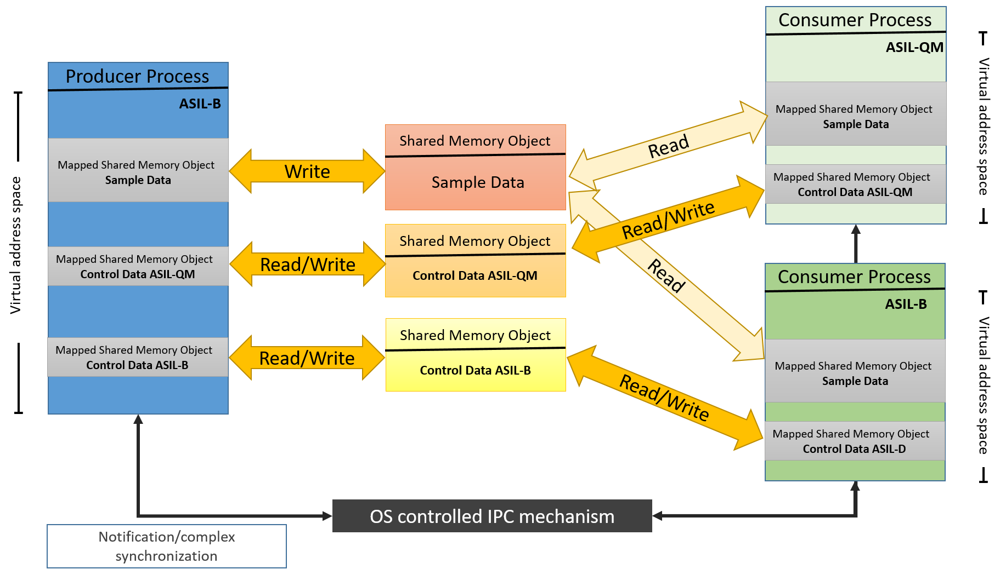
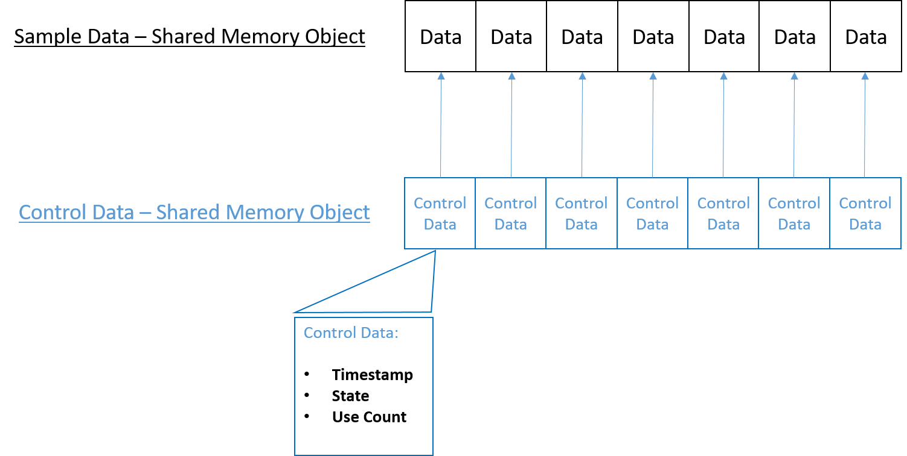
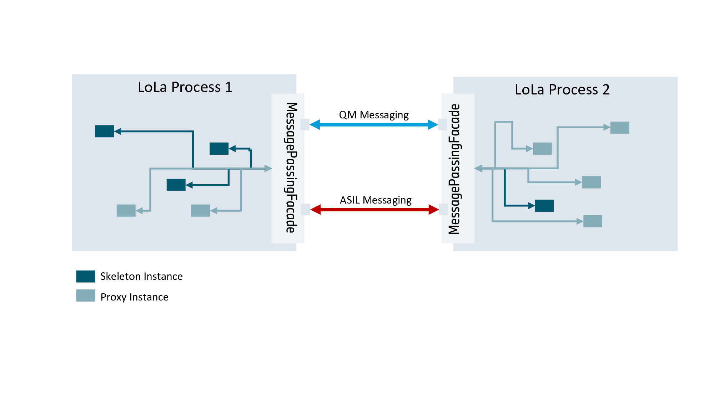
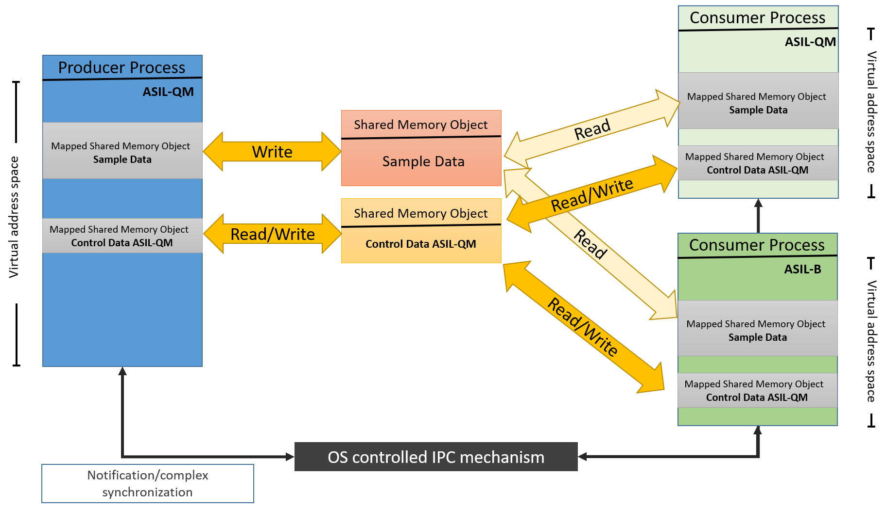

# LoLa - Inter Process Communication (IPC) <!-- omit in toc -->

```{toctree}
:maxdepth: 1
:glob:
:hidden:
```

LoLa (Low Latency) IPC represents a safe zero-copy shared-memory based IPC mechanism.
This document describes the high-level architecture concept.

## Technical Concept Description

Our communication stack foresees two major building blocks that implement `mw::com`.
One is the so-called *frontend*, the other one *binding*. The idea is that the *frontend* does not change depending
on which *binding* is selected. Meaning, the *frontend* stays the same no matter if we use SOME/IP or Shared Memory
as *binding*. In order to be as flexible as possible and reduce compilation times in the CI, we want to follow the
*Multi Target Build* concept. In summary, it shall be possible to configure on runtime which *binding* shall be used.
While this does not make sense at the moment, since we have only one binding, it ensures that no deployment information
leaks into the *frontend* and thus we can reduce compilation times (e.g. by only generating C++ libraries per interface).

The basic idea of our LoLa concept is to use two main operating system facilities:

1. *Shared Memory*: Shall be used for the heavy lifting of data exchange
2. *Message Passing*: Shall be used as notification mechanism

We decided for this side channel since implementing a notification system via shared memory would include
the usage of condition variables. These condition variables would require a mutex, which would require
read-write access. This could lead to the situation that a malicious process could lock the mutex
forever and thus destroy any event notification. In general, we can say that any kind of notification
shall be exchanged via message passing facilities. The [sub-section](#message-passing-facilities) below will go into more detail for the Message Passing Facilities.

The usage of shared memory has some implications. First, any synchronization regarding thread-safety / process-safety
needs to be performed by the user. Second, the memory that is shared between the processes is directly mapped into
their virtual address space. This implies that it is easy for a misbehaving process to destroy or manipulate any data
within this memory segment. In order to cope with the latter, we split up the shared memory into three segments.

- First, a segment where only the to-be-exchanged data is provided. This segment shall be read-only to consumer
and only writeable by the producer. This will ensure that nobody besides the
producer process can manipulate the provided data.
- The second and third segment shall contain necessary control information
for the data segment. Necessary control information can include atomics that are
used to synchronize the access to the data segments. Since this kind of access requires write access, we split the shared memory
segments for control data by ASIL Level. This way it can be ensured that no low-level ASIL process interferes with higher level ones.
More information on shared memory handling can be found in [sub-section](#shared-memory-handling).



One of the main ideas in this concept is the split of control data from sample (user) data.
In order to ensure a mapping, the shared memory segments are divided into slots. By convention, we then define
that the slot indexes correlate. Meaning, slot 0 in the control data is user to synchronize slot 0 in the sample data.
More information on these slot and the underlying algorithm can be found in [sub-section](#synchronization-algorithm).



#### Error reporting

We follow a general/common approach regarding error reporting: [score::result](https://github.com/eclipse-score/baselibs/tree/main/score/result#result)

### Message Passing Facilities

The Message Passing facilities, under QNX this will be implemented by QNX Message Passing, will *not* be used to
synchronize the access to the shared memory segments. This is done over the control segments. We utilize message passing
for notifications only.

This is done, since there is no need to implement an additional notification handling via shared memory, which would only
be possible by using mutexes and condition variables. The utilization of mutexes would make the implementation of a wait-free algorithms
more difficult. As illustrated in the graphic below a process should provide one message passing port to receive data for each supported ASIL-Level.
In order to ensure that messages received from QM processes will not influence ASIL messages, each message passing port shall use a custom thread to wait for new messages.
Further, it must be possible to register callbacks for mentioned messages.
These callbacks shall then be invoked in the context of the message passing port specific thread. This way we
can ensure that messages are received in a serialized manner.



### Shared Memory Handling

POSIX based operating systems generally support two kinds of shared memory: file-backed and anonymous.
Former is represented by a file within the file-system, while the latter is not visible directly to other processes. We decide for former,
as we then can avoid to introduce an additional step to exchange anonymous file handles for shared-memory-objects.
In order to avoid fault propagation over restarts of the system, any shared memory communication shall not be persistent.
Processes will identify shared memory segments over their name. The name will be commonly known by producers and consumers and deduced by additional
parameters like for example service id and instance id. When it comes to the granularity of the data stored
in the shared memory segments, multiple options can be considered. We could have one triplet of shared memory segments per process or one triplet
of shared memory segments per event within a service instance. Former would make the ASIL-Split of segments quite hard, while
the latter would explode the number of necessary segments within the system. As trade-of we decided to have one triplet of shared memory segments per service instance.

It is possible to map shared memory segments to a fixed virtual address. This is highly discouraged by POSIX and leads to
undefined behaviour. Thus, shared memory segments will be mapped to different virtual adresses. In consequence
no raw pointer can be stored within shared memory, since it will be invalid within another process. Only offset pointer (fancy pointer, relative pointer)
shall be stored within shared memory segments.

The usage of shared memory does not involve the operating system, after shared memory segments are setup. Thus, the operating system
can no longer ensure freedom from interference between processes that have access to these shared memory regions. In order to restrict
access we use ACL support of the operating system. In addition
to the restricted permissions, we have to ensure that a corrupted shared memory region cannot influence other process-local memory regions.
This can be ensured by performing *Active Bounds Checking*. So the only way how data corruption could propagate throughout a shared
memory region is if a pointer within a shared memory region points out of it. Thus, a write operation to such a pointer could forward
memory corruption. The basic idea to overcome such a scenario is, that we check that any pointer stays within the bounds of the shared memory region.
Since anyhow only offset pointer can be stored in a shared memory region, this active bound check can be performed whenever
an offset pointer is dereferenced. The last possible impact can be on timing. If another process for example wrongly locks a mutex
within the shared memory region and another process would then wait for this lock, we would end up in a deadlock. While this should not harm
any safety goal, we still want to strive for wait-free algorithms to avoid such situations.

### Synchronization Algorithm

A slot shall contain all necessary meta-information in order to synchronize data access.
This information most certainly needs to include a timestamp to indicate the order of produced data within the slots.
Additionally, a use count is needed, indicating if a slot is currently in use by one process. The concrete data is
implementation defined and must be covered by the detailed design.

The main idea of the algorithm is that a producer shall always be able to store one new data sample.
If he cannot find a respective slot, this indicates a contract violation, which indicates that a QM process misbehaved.
In such a case, a producer should exclude any QM consumer from the communication.

This whole idea builds up on the split of shared memory segments by ASIL levels. This way we can ensure that an QM process
will not *degradate* the ASIL Level for a communication path. In another case, where we already have a QM producer, it is
possible for an ASIL B consumer to consume the QM data. In that case the data will always be QM since it is impossible for the middleware to apply additional
checks to enhance the quality of data. This can only be done on application layer level.



## Additional Considerations

### Security

The operation of shared memory is always a security concern, since it makes it easier for an attacker
to access the memory space of another process.

This is especially true, if two processes have read / write access to the same pages.
We are confident that our applied mechanisms, like reduced access to shared memory segements
and active bounds checking prevent any further attack vectors.

The only scenario that is not covered is an attack against the control segments.
An attacker could in the worst case null all usage counter. In that scenario a race-condition
could happen, that data that is read, is written at the same time, causing incomplete data reads.

This is a drawback that comes with the benefit of less overhead for read/write synchronization,
reducing our latency a lot. At this point in time we accept this drawback by the benefit of the performance.

### Performance

This is a performance measure. Thus, we expect a reduction in latency in communication
and a reduced memory footprint, since there is no longer the need for memory copies.

### Diagnostics

There are no implications on diagnostics, since there will be no diagnostic job used.

### Testing

There will be substantial need for testing. A concrete test plan is only possible after the FMEA.
At this point we are sure that all tests can be executed utilizing ITF Tests.
This is necessary, since the tests heavily rely on the operating system.
All other tests will be possible to be conducted as unit tests.

### Dynamic Invocation Interface

For some use cases a loosely typed
interface to services, which can be created dynamically during runtime without the need of compile-time dependencies,
would be favorable. For this the [DII concept](./mw_com_dii/README.md) has been created, which LoLa will implement for
event communication.
