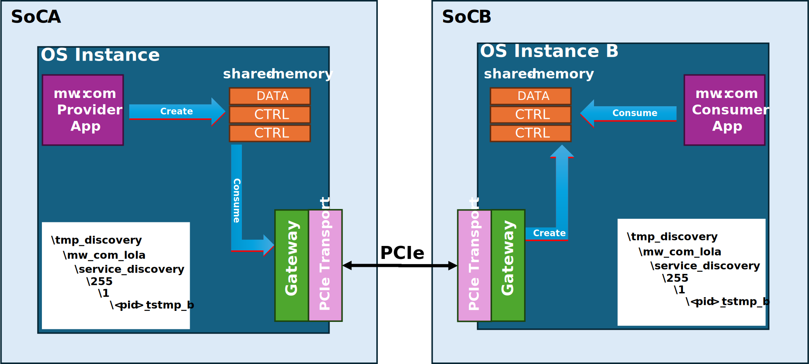
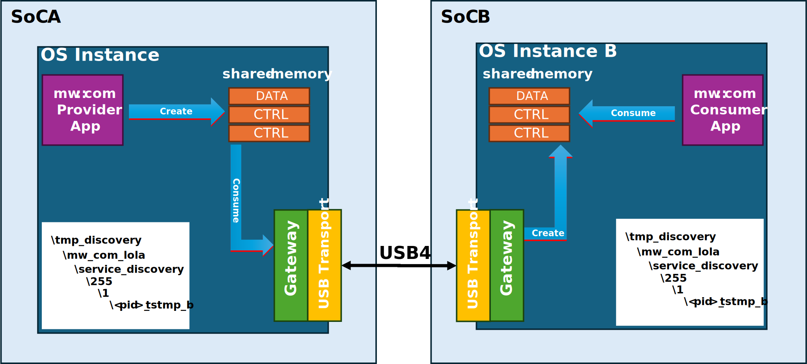
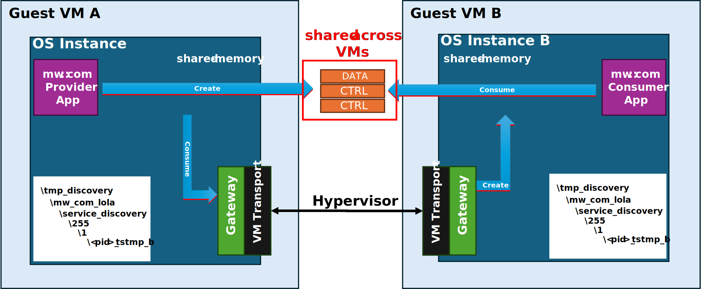
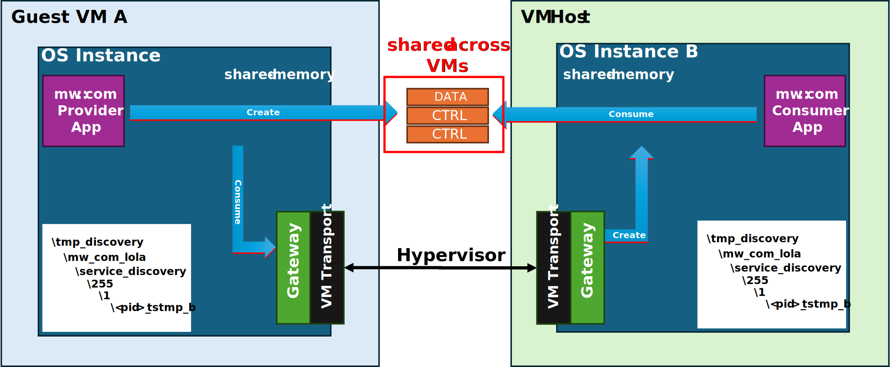
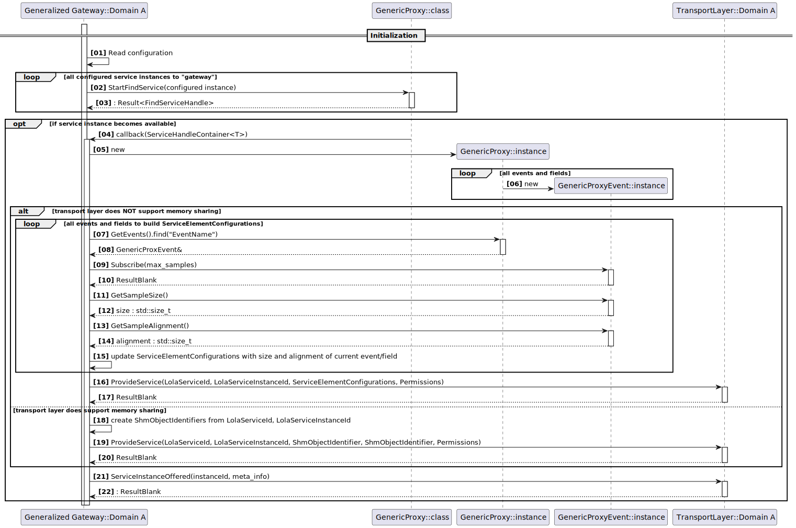
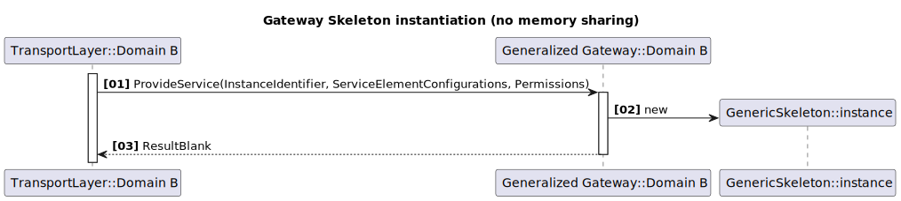
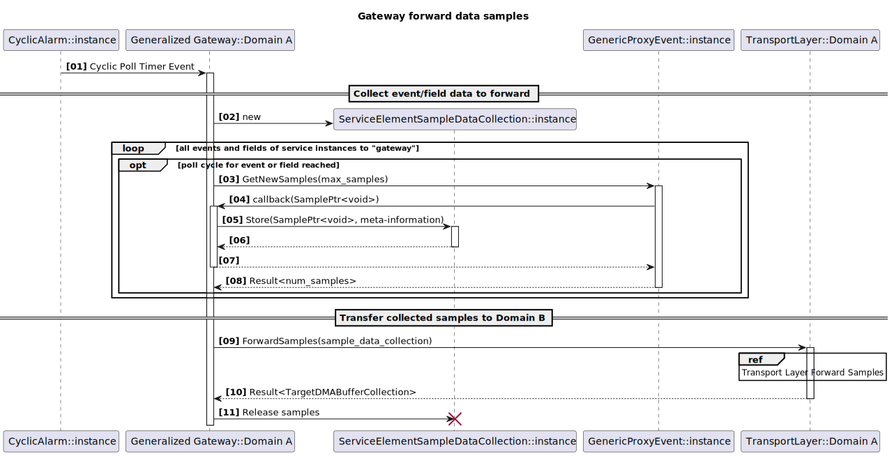
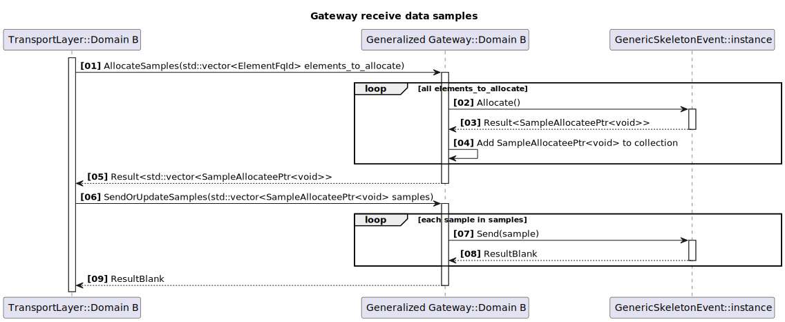

# Concept for a generalized LoLa Gateway

```{toctree}
:maxdepth: 1
:glob:
:hidden:

*/README
```

## Intro

We already developed a concept, how to enable `mw::com` communication between two
distinct SoCs, which are interconnected via `PCIe`. This concept can be found [here](../pci_e_gateway/README.md).
Recent discussions showed, that there are further gateway setups needed. Therefore, we now **generalize** the existing `PCIe` gateway concept.
Examples, where such a generalized gateway concept could be applied:

- `mw::com` communication between SoCs interconnected with some physical link (e.g. `PCIe`, `USB4`, ...)
- `mw::com` communication on a hypervisor setup:
  - VM-guest to VM-guest communication (guests having identical or different OSes)
  - VM-guest to VM-host/hypervisor communication

The generalized `LoLa` gateway is specifically designed to forward `mw::com` communication that uses the `LoLa`
shared-memory binding. Because of this, the gateway works with `LoLa`-specific mechanisms rather than relying only on
the binding-independent `mw::com` abstraction.

From this point on, communication is therefore described in terms of gateways between `LoLa` domains. A `LoLa` domain
consists of a set of applications running within the same OS instance. that communicate using `LoLa` proxies and
skeletons. Each `LoLa` domain depends on OS-specific low-level services:

- shared-memory management for `DATA` and `CONTROL` shared memory objects
- message-passing implementation for event update, partial-restart and service-method related notifications, ...
- service-discovery mechanism
- marker-files with `flock`-support

This concept describes solutions, how those low-level services can be either bridged between two `LoLa domains` or can
be replaced with different mechanisms, which fit better to the specific cross-domain setup.

## Gateway Process per Domain

The generalized gateway concept envisions, that each `LoLa domain` contains a specific gateway process instance, which
is responsible to:

- forward service instance data/control-information to the other domain.
- receive service instance data/control-information from the other domain.

It always has a counterpart gateway process in the other `LoLa domain`, with which it communicates with to
forward/receive the service instance data/control-information.

From a functional perspective, we do have **one** gateway, which is implemented as two gateway process instances, one in
each `LoLa domain`.

The reason, that we need a single instance, opposed to implementing this `gatewaying` functionality within each
`mw::com`
process in the form of a library:

- the "border" between `LoLa domain`s (examples are shown in the next chapter), which has to be bridged is often
  represented by a single resource, which needs to be managed and accessed in a synchronized way.
- this allows better overall optimization of the data transfers between the SoCs.

## Generalized Gateway Overview

Here are some examples, how the generalized gateway could be deployed in different scenarios:

The already mentioned `PCIe` gateway between two SoCs interconnected via `PCIe`:



An almost identical setup, but SoCs interconnected via USB4:



And now following two hypervisor related setups:





As you see in all these examples, the core gateway concept remains the same. Only the specific transport mechanism
between both `LoLa domain`s is adapted/plugged-in. Even if &ndash; in specific setups &ndash; routing the `LoLa`
communication through gateway instances might seem as a potential bottleneck, it shouldn't be the case!
The figures above might suggest, that there happens a lot of data copying between the gateway instances. However, the
actual implementation of such gateway instances should be as efficient as possible. While we typically see data
copying taking place in the context of `gatewaying` between two SoCs, which do not have a common shared memory region,
in hypervisor setups we can often exploit shared memory regions between guest/guest and guest/host. Thus, data copying
can be avoided in many cases.

Moreover, the generalized setup has major benefits:

- A `LoLa` application does not need to know whether communication stays within its own `LoLa` domain or crosses into
  another `LoLa` domain. It always uses the same local `LoLa` shared-memory binding, while gateways handle cross-domain
  communication transparently.
- with a central gateway on the domain boundaries, we have a single point to implement optimizations, monitoring,
  logging, security checks, ...

## Basic Architecture of a Generalized LoLa Gateway

The generalized LoLa gateway consists of the following main components:

- LoLa Gateway Core: Implements the generalized `LoLa` gateway logic, which is transport layer agnostic.
- Transport Layer Abstraction API: Abstracts the transport layer specific implementation from the `LoLa` Gateway Core.
- Transport Layer Implementation: Implements the transport layer specific logic to forward/receive service instance

### Transport Layer Abstraction

According to the different scenarios, where the generalized LoLa gateway could be applied (see previous chapter), the
transport layer implementation will differ. Therefore, we need to abstract the transport layer specific logic from
the generalized LoLa gateway logic. This is done via the `Transport Layer Abstraction API`.

The `Transport Layer Abstraction API` and how the `LoLa Gateway Core` interacts with it, is described in detail
[here](./transport_layer/README.md).

Thus, we expect different transport layer implementations to be plugged-in to the generalized `LoLa` gateway core.
E.g. an implementations for:

- LoLa domains residing on different SoCs interconnected via PCIe/USB4
- LoLa domains residing on different VMs on a hypervisor

### Glossary

| Term                     | Description                                                                                                                                                                                                                                                                                                                                                                                                                                                               |
|--------------------------|---------------------------------------------------------------------------------------------------------------------------------------------------------------------------------------------------------------------------------------------------------------------------------------------------------------------------------------------------------------------------------------------------------------------------------------------------------------------------|
| `LoLa Domain`            | A set of applications running within the same OS instance that communicate using LoLa proxies and skeletons.                                                                                                                                                                                                                                                                                                                                                              |
| `Source Gateway`         | The gateway process instance in the LoLa domain, where a service instance is originally provided and which "forwards" this service instance to the other domain. Since a gateway process instance is typically part of bidirectional communication between two LoLa domains, it can also take over the role of a Destination Gateway for service instances, which are originally provided on the other domain. Thus, Source Gateway is rather a role than a fixed entity. |
| `Destination Gateway`    | The gateway process instance in the LoLa domain, to which the Source Gateway "forwards" the service instance. Since a gateway process instance is typically part of bidirectional communication between two LoLa domains, it can also take over the role of a Source Gateway for service instances, which are provided in its own domain. Thus, Destination Gateway is rather a role than a fixed entity.                                                                 |
| `Forwarding Skeleton`    | The skeleton instance created by the Destination Gateway, which acts as a substitute for the original skeleton in the source domain.                                                                                                                                                                                                                                                                                                                                      |
| `Copying Gateway`        | A gateway implementation, which copies data between both `LoLa domains`, since the `Transport Layer` capabilities don't allow shared-memory between domains.                                                                                                                                                                                                                                                                                                              |
| `MemorySharing Gateway`  | A gateway implementation, which relies on memory-sharing between both `LoLa domains`, since the `Transport Layer` capabilities allow shared-memory between domains.                                                                                                                                                                                                                                                                                                       |

### Consumer and Provider Roles

From `mw::com` perspective, a gateway process instance takes over a service instance consumer and provider role within
its domain:

- Consumer role: For each service instance provided locally within its domain, which shall be also provided to the other
  domain, the `Source Gateway` takes over the role of a consumer. Thus, it creates a `mw::com` proxy instance, to
  "consume" the locally provided service instance. "Consume" here means roughly: Subscribe to events and fields,
  eventually access the event and field samples and then forward the sample data via the transport layer to the other
  domain.
- Provider role: For each service instance provided on the **other** domain, and where the `Source Gateway` on the other
  domain forwards sample data via the transport layer to the `Destination Gateway`, the `Destination Gateway` creates a
  `mw:com` skeleton instance (`Forwarding Skeleton`) and offers it.

### Which service instances to gateway

A gateway process instance needs to have knowledge, which locally provided service instances, it shall forward to the
other domain.
This means, it needs an explicit list of service instances, identified by `service-type` and `instance-id`, for which it
takes over the role as consumer. Symmetrically, it needs an explicit list of service instances, for which it
takes over the role as provider. How the configuration shall be handled for the generalized gateway use case is detailed
in the [configuration chapter](#configuration-and-tooling).

### Instantiating a proxy

For all locally provided service instances, for which the `Source Gateway` takes over the role as a consumer, it
instantiates a corresponding proxy. Since the gateway does **not** semantically interpret the event and field data of
the provided service instance, but "just" transfers "byte arrays" via the transport layer, it does **not** need a
strongly typed proxy. I.e. a proxy with strongly typed `ProxyEvent`s and `ProxyField`s.
A `GenericProxy`, which `mw::com` already provides, is a loosely typed proxy and fits exactly to the use case here. The
benefit is, that such a proxy can be instantiated based on deployment info alone. This can be done dynamically during
runtime, **without** the need to recompile the gateway code for each newly introduced provided service type, which it is
going to consume!

Note, that the statement above, that the gateway transfers "byte arrays" via the transport layer, is **not** always
true.
In setups, where shared memory regions are available between both domains, the gateway might just share the shared
memory objects between both domains and avoid data copying. This depends on the capabilities the concrete implementation
of the [Transport Layer](#transport-layer-abstraction) provides. Details about this are described in the
[Transport Layer Abstraction API](./transport_layer/README.md#capability-checks).

The following sequence diagram shows this `mw::com` proxy instantiation, which the gateway does in the role of a
consumer
of a domain local service instance, which it wants to provide to the other domain.
This sequence also contains further steps, after the proxy instantiation happened, which give some insight, how
information
acquired via the proxy is then used in calls to the `Transport Layer`.



The sequence diagram intentionally stops at the border of its local transport layer implementation. Details about the
sequence behind the transport layer are documented in
the [Transport Layer Abstraction API](./transport_layer/README.md).

### Destroying a proxy

Whether/when a `Source Gateway` instance destroys a `GenericProxy` instance again, depends on the `Transport Layer`
capabilities.

In case of a `Copying Gateway`:

- the STOP-OFFER for the service instance is detected by the `Source Gateway` and forwarded to the `Destination Gateway`
  via `TransportLayerAPI`.
- the `Source Gateway` **destroys its corresponding proxy instance**.
- the `Destination Gateway` does a STOP-OFFER on its `Forwarding Skeleton`.
- the `Destination Gateway` destroys its `Forwarding Skeleton` (shared-memory objects on the destination side may
  persist or not depending on whether proxies are connected or not)

In case of a `MemorySharing Gateway`:

- the STOP-OFFER for the service instance is detected by the `Source Gateway` and forwarded to the `Destination Gateway`
  via `TransportLayerAPI`.
- the `Source Gateway` **only destroys its corresponding proxy instance, when it knows, that there are NO proxies on the
  destination domain**, which currently use the service instance (access its shm-objects).
  Reason: The proxy instance of the `Source Gateway` hinders shm-object unlinking via service-usage-marker-file! It is
  also doing this job for the shm-objects users in the destination domain! This is essential!
- the `Destination Gateway` does a STOP-OFFER on its `Forwarding Skeleton`
- the `Destination Gateway` destroys its `Forwarding Skeleton` (shared-memory objects on the destination side are **not**
  controlled by this skeleton, i.e. whether they still exist or not after destruction only depends on the decision taken
  on the `Source Gateway` with regard to its proxy instance.)

How the `Source Gateway` can decide whether there are proxies on the destination domain, which currently use the service
instance, is explained here:

- currently a `lola::Skeleton` does not remove its service_usage_marker_file from the filesystem, when it is destroyed.
- we need to change this: When a `lola::Skeleton` is destroyed, it removes its service_usage_marker_file, in case it is
  able to lock it exclusively (i.e. no other process holds a lock on it).
- the `Destination Gateway` shall report back, whether after destruction of its `Forwarding Skeleton`, the service_usage_marker_file
  could be removed or not.

### Instantiating a skeleton

Symmetrically to the consuming side, the gateway process instance in the role of the `Destination Gateway` has to
instantiate `Forwarding Skeleton`s for each service instance, it shall provide locally. I.e. those skeletons, which are
the local substitutes of the skeletons from the source domain.

This instantiation happens in the context of a notification from the transport layer, that a new service instance
is now available on the other domain, which shall be provided locally. Upon receiving such a notification, the gateway
instantiates a skeleton for this service instance.

The type/functionality of the skeleton being instantiated, depends heavily on the transport layer capabilities!

If the transport layer implementation **doesn't** allow to share shared memory regions between both domains, the
skeleton, being created in the local domain as a substitute, creates its own shared memory objects for DATA and CTRL.
Then later, when the skeleton receives event data or field updates via the transport layer from the other domain,
it writes the data into its own shared memory objects.

If the transport layer implementation **does** allow to share shared memory regions between both domains, the
skeleton, being created in the local domain as a substitute, creates **no** shared memory objects for DATA and CTRL at
all!
It expects, that the `Transport Layer` has made the shared memory objects created by the "real" skeleton on the other
domain available in the local domain. So the created skeleton instance just uses/references these shared memory objects.

Unlike on the consuming side, where we can build upon the existing `mw::com::GenericProxy` for this use case, there is
`not yet` a corresponding `mw::com::GenericSkeleton`. But since we have the same requirement here, that we do not want
to recompile the gateway codebase, when we introduce a new service type, which the gateway shall provide locally, we
technically need such a `mw::com::GenericSkeleton`.
According to the explanation above, we need also a distinction between the skeleton creating shared memory objects and
the skeleton using existing shared memory objects. Since this is a decision on the binding level
(`score::mw::com::impl::<binding>>`) this will be handled on deployment/configuration level. I.e. the `InstanceSpecifier`
used to instantiate the skeleton will point to a deployment element in the configuration, which specifies, whether a
`lola::Skeleton` shall be created with its own shared memory objects or referencing existing ones.

#### Extending mw::com with GenericSkeleton class

A newly to be introduced `mw::com::GenericSkeleton` class will be structurally similar to `mw::com::GenericProxy`. Thus,
instead of having discrete members for its provided events and fields, it will have maps, where field and event
instances can be looked up by name during runtime. These instances are then &ndash; similar to the
`mw::com::GenericProxy` case &ndash; typed by either `GenericSkeletonEvent` or `GenericSkeletonField`.

There is some minimal meta-information a `mw::com::GenericProxy` needs about its contained fields and events. Things
like
the event or field name, its maximum data size and also its required alignment. Since it intentionally has no type
information about its events and fields, from which it could get this information, it needs to obtain the information
elsewhere. The `mw::com::GenericProxy` looks this information up from shared-memory. The provider side (strongly typed)
skeleton, which creates the shared memory, populates it also with this necessary meta-info for all its events and
fields.
So a `mw::com::GenericProxy` looks it up during its creation, where it already accesses the shared-memory created by the
provider.

In the case of `mw::com::GenericSkeleton` we need obviously a different solution. I.e. since this is the provider side,
which creates the shared-memory, it needs this information already on construction. In our generalized gateway scenario,
this essential meta-info will be provided by the "real" skeleton instance on the providing domain. The meta-info
provided in the shared-memory will then be read by the provider side gateway via its consuming `mw::com::GenericProxy`
and communicated to the `Destination Gateway` on the other domain, where then a `Forwarding Skeleton` (substitute
`mw::com::GenericSkeleton`) instance gets created, getting this meta-information as input. The main information
contained in the meta-information handed over to the `Create` call of the `mw::com::GenericSkeleton` is:

- event and field names
- sample sizes and alignments of events and fields

Additional information needed for instantiation of a `mw::com::GenericSkeleton` instance is the following:

- how many slots to allocate for a given event or field (only needed, when the skeleton creates its own shared memory
  objects)
- shall it be ASIL-B or QM only
- what are the allowed consumers (ASIL-B and QM)

This information is "deployment" information, which needs to be part of the `mw_com_config.json` of the
`Destination Gateway`!
So at 1st glance, this seems a bit counter-intuitive, since we want to have the `mw::com::GenericSkeleton` very flexible.
Requiring deployment information for its instantiation seems to contradict this.
However, this deployment information is not type-specific, therefore no recompile is needed, when a new service type is
introduced. It is just additional configuration information, which needs to be provided for the gateway process.
This makes perfect sense, if you take into account:

- the deployment information used by the `mw::com::GenericSkeleton` is anyhow needed by consumers/proxies in the
  destination domain, otherwise they couldn't connect to the service instance provided by the `mw::com::GenericSkeleton`.
- if we would try to hand over the deployment specific information in the `Create` call of the `mw::com::GenericSkeleton`
  this would violate `mw::com` layer separation! Deployment and therefore binding specific information is not part of the
  binding independent `mw::com` API layer.

The following sequence diagram shows the steps up to the instantiation of a skeleton triggered by a notification via
`Transport Layer`, that a service instance provided on the other side, shall be provided:



### Destroying a skeleton

When the destroyal of a `Forwarding Skeleton` happens, can be seen in the [proxy destruction chapter](#destroying-a-proxy).

### Communicating event-sends and field-updates

The level of involvement of the gateway in forwarding event-sends and field-updates between both domains depends heavily
on the capabilities of the `Transport Layer` implementation.
If the `Transport Layer` implementation allows to share shared memory regions between both domains, the gateway
is not involved at all in forwarding event-sends and field-updates. Since the shared memory objects are
shared between both domains, event-sends and field-updates done on one domain are directly visible on the other domain.

However, if the `Transport Layer` implementation does **not** allow to share shared memory regions between both
domains, the gateway needs to be actively involved in forwarding event-sends and field-updates between both domains as
it has in this case to trigger specific copy-API calls in the `Transport Layer Abstraction`.

**So the following sections describe the data forwarding logic in the case, where the `Transport Layer` implementation
does not allow to share shared memory objects between both domains.**

There are conceptually two approaches, when data updates, being done by the original service instance provider, are
forwarded via the `Transport Layer Abstraction`:

- `event-driven`
- `cyclically` (or polling)

The `event-driven` mode requires, that the proxy instances spawned by the gateway on the provider side domain register
`mw::com` `EventReceiveHandler`. This way the proxy instance gets notified, when the service instance provider did an
event or field update and can thus call `Proxy<Event|Field>GetNewSamples()` in a timely manner to instantly get the
updated samples and transfer the underlying data via `Transport Layer Abstraction` to the other domain.

Opposed to the `event-driven` mode, the gateway in `cyclically` mode iterates over all the events and fields of the
provided service instances calling `GetNewSamples()` cyclically. So it can be either the case, that for a given event or
field, there is either no new sample at all or there are 1 to N new samples.

The main benefit of the `event-driven` mode is the relatively small latency between an event or field update on one
domain until it gets visible also on the other domain.
But it has also some severe downsides:

- usage of `EventReceiveHandler`s on the providing domain side leads to lots of `message_passing` inflicted context
  switches. This can be detrimental for overall performance on the provider side.
- we would need to set up a data transfer via `Transport Layer Abstraction` per each updated event or field sample.
  This means lots of rather small transfers. `Transport Layer Abstraction` implementations with data-copying support may
  perform better, when doing bulk transfers (e.g. scatter-gather transfers, which PCIe allows, to do massive batching of
  small data transfers into a single big transfer).

There is also a third option on the table: Explicitly trigger the gateway to forward specific event or field updates to
the other side. This application driven update makes very much sense, when at a certain point in time at provider domain
side a known update of a certain amount of fields or events has happened. Then specifically triggering the update might
be very effective and have some benefit over both other solutions above. So we add here:

- `trigger synchronization-group`

i.e. we foresee configuring so called `synchronization-group`s, which means, that you can assign fields and events of
service instances to arbitrary named `synchronization-group`s. And then the gateway provides a trigger-API, where you
hand over the `synchronization-group` name, which leads to forward the updated data of the events or fields contained in
the given `synchronization-group`.

So in this concept, we propose to implement all of these 3 variants. Which one is chosen for a specific event or
field instance is set in the configuration.

Here are the steps taken on the gateway on provider side, when data forwarding for a given event or field instance is
due:

1. call `GetNewSamples` with a specifically configured `max_samples` number.
2. collect the `SamplePtr`s returned via callback plus the needed meta-information like `service-id`, `instance-id`,
   `element-id`.
3. Trigger the transport layer to forward the collected samples.
4. Release the collected `SamplePtr`s



The receiving gateway side is triggered by the provider side step (3), where it gets informed about which event or
field samples the provider wants to transfer in the current cycle. So receiving side steps from this point onwards are:

1. Receive `AllocateSamples` request.
2. Call `SkeletonEvent::Allocate()` or `SkeletonField::Allocate()` for each sample in the `AllocateSamples` call and
   collect all `SampleAllocateePtrs` in a vector, which is then returned to the transport layer.

   **Attention**: If we want to enable multiple updates for a specific event or field instance within one transfer
   due to massive batching, we have to explicitly foresee such a support for our `SkeletonEvent` and `SkeletonField`
   classes!
   Currently, we are working on "refined" `GetNewSamples` API signatures with replacement `SamplePtr` candidates, were
   support for multiple parallel allocations might be prohibitive!
3. Then the transport layer calls `SendOrUpdateSamples` with all the SampleAllocateePtrs collected in step (2), for
   which he had done the data copying. The gateway then calls `SkeletonEvent::SendSamples()` or
   `SkeletonField::UpdateSamples()`
   with the given SampleAllocateePtrs.



### Optimizations for event-sends and field-updates

To keep things simply, we currently propose, that each `GenericProxy` being used by the gateway on provider side
subscribes
to all events and fields of the provided service instance (which have been configured to be forwarded to the other
domain).
Completely independent of, whether on the consuming side there are actually any consumers of these events or fields!
We then also always forward all event-sends and field-updates to the other domain in the configured way (event-driven,
cyclically, trigger synchronization-group). If we want to avoid unnecessary data transfers, we can implement
optimizations
in the gateway on provider side, which supervise, whether there are actually any consumers of a given event or field on
the
consuming side. If there are no consumers, we can skip forwarding the data updates for this event or field.

But this needs some extensions in `mw::com` to be able to supervise, whether there are consumers of a given event or
field
on the consuming side. Currently, a `mw::com` skeleton event or field doesn't provide a public API, to either query,
whether there are subscribers currently or a mechanism to register a handler being called if the subscribe situation
changes.

### Communicating event/field update notifications

Registering for event/field update notifications from the consumer side at the provider side and the corresponding
reverse notification from the provider side to the consumer side is **always** necessary, **independent** of the
capabilities of the `Transport Layer` implementation!
The reason is, that this communication is done via `message-passing` side-channel and not via shared-memory.

The registration for event/field update notifications happens in the consuming domain in the context of user code
calling `ProxyEvent::SetReceiveHandler()`.
This call will lead to a message-passing communication to the gateway instance on the consuming domain (i.e. same domain
as the proxy instance resides in), since the user code contains a proxy instance connected to the "deputy" skeleton
created by this gateway instance.

This registration needs to be forwarded to the providing domain side gateway instance, since there the actual
event/field updates happen.
This is accomplished via an extension to be introduced for the `GenericSkeleton` used by the gateway on the consumer
side:
An `impl::SkeletonEvent` has a mechanism to supervise, whether there are registered receive handlers for it at all.
We need an extension, that a change on this situation gets notified to the gateway instance on the consumer side.
As soon as such a change happens (i.e. the first receive handler is registered or the last one is unregistered), the
gateway instance on the consumer side will inform the gateway instance on the providing domain side via transport layer
about this change.
Then on the providing domain side gateway instance can register or unregister the corresponding message-passing
update-notification handlers on its consuming proxy instance. The handler, the gateway instance registers there, will
then
forward the update-notifications via transport layer to the consuming gateway instance, which then will forward this
notification via `MessagePassingInstance::NotifyEvent(ElementFqId)` to the consuming proxy instances.

## Configuration and Tooling

TBD
