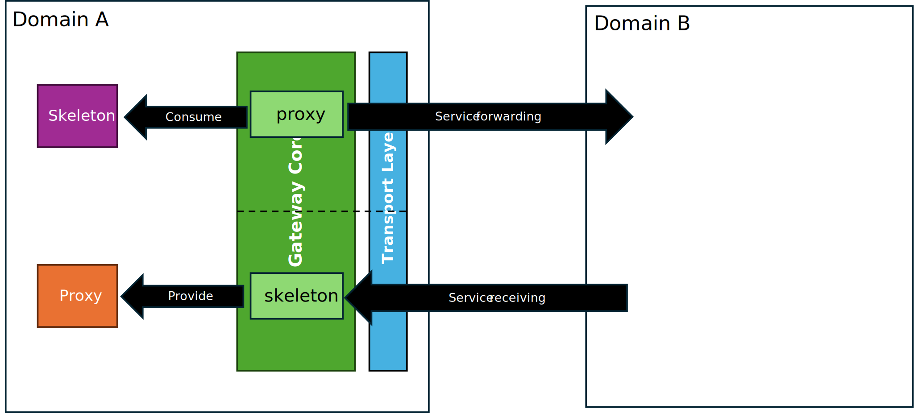
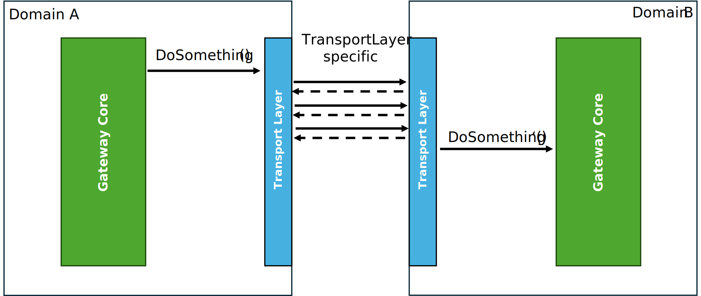
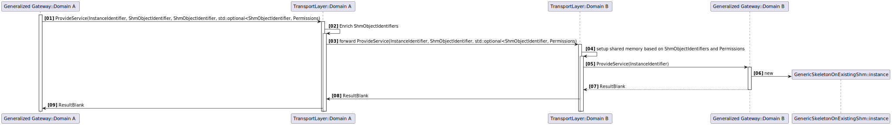
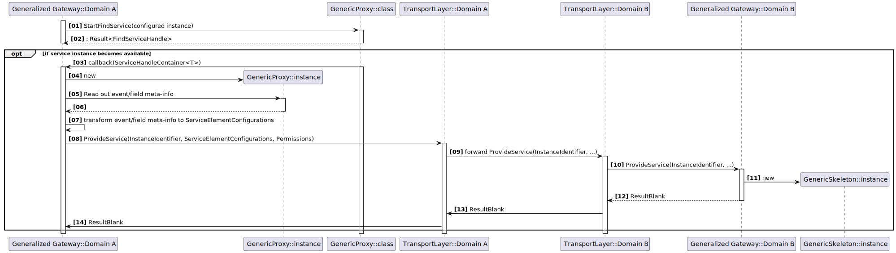
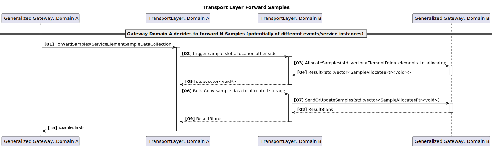
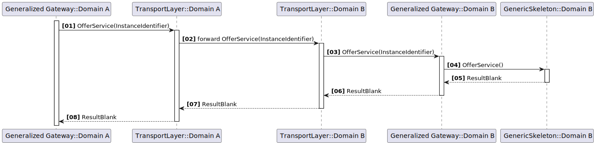
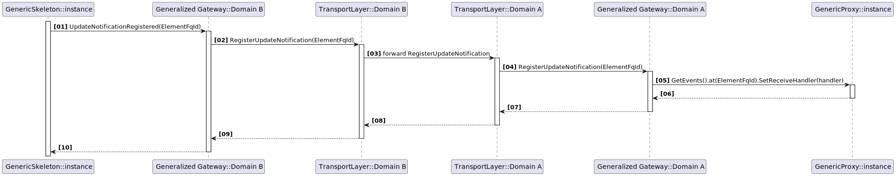

# Transport Layer API

## Introduction

The generalized gateway approach expects a standardized interface for the transport layer used between gateway instances
on different domains.
This interface needs to be abstract enough to support also **semantically** different underlying transport mechanisms.
The main semantically difference is, whether a transport layer supports shared memory between domains or not. In case
memory sharing is **not** supported, the interface needs to explicitly support APIs for copying data. From the pov
of the `generic gateway core`, which uses the transport layer interface, it will apply different call sequences depending
on the underlying transport layer semantics I.e. whether memory sharing is supported or not.

## API

The API of the transport layer is divided into two logical areas:

- API for service forwarding (provider side)
- API for service receiving (consumer side)



When the `generic gateway core` takes over the role to forward a **local** service instance to the other domain, it
instantiates a proxy to "consume" the local service instance and then uses the `API for service forwarding` provided by
the transport layer.
However, when the `generic gateway core` takes over the role to represent a **remote** service instance locally, it
instantiates a skeleton to "provide" the local representation of the remote service instance and then uses the
`API for service receiving` provided by the transport layer.

In both cases the `generic gateway core` also provides a specific set of APIs to be called by the transport layer.
Each API the `generic gateway core` provides to the transport layer in one area **mirrors** somewhat the API the
`generic gateway core` requires from the `generic gateway core` in the other area. This is trivial as all the API calls
a `generic gateway core` does on its local transport layer instance at some point end up at the `generic gateway core`
in the other domain. I.e. even if for some API the transport layer implementation has to do complex things, which might
include multiple interactions between both transport layer instances, at some point an API call to the
`generic gateway core` in the other domain takes place, which in most cases has the same API name, but a slightly
adapted signature as the following figure suggests:



### Capability Checks

To distinguish between transport layers supporting memory sharing between domains and those not supporting it, the
following capability check API shall be provided by every transport layer implementation:

```cpp
bool TransportLayer::IsMemorySharingSupported()
```

## API (service forwarding)

These are the APIs required from the transport layer by the generalized gateway core, when forwarding a local service
instance to the other domain. I.e. the APIs called from the transport layer in the following cases:

- `ProvideService`: Provider side gateway wants to provide its local service instance on the other domain.
- `OfferService`: Provider side gateway wants to start service offering of the service instance on the other domain.
- `StopOfferService`: Provider side gateway wants to stop service offering of the service instance on the other domain.
- `ForwardSamples` (only if `IsMemorySharingSupported() == false`): Provider side gateway wants to forward a set of
  event/field sample updates to the other domain.
- `UpdateNotification`: Provider side gateway wants to inform the gateway on the other domain, that an event/field update
  took place.

The APIs provided by the `generic gateway core` to the transport layer in this case are:

- `RegisterUpdateNotification`: Consumer side gateway registers an event/field update notification on the other domain.
- `UnregisterUpdateNotification`: Consumer side gateway unregisters an event/field update notification on the other
  domain.
- `Subscribe` (only if `IsMemorySharingSupported() == false`): Consumer side gateway subscribes for event/field on the
  other domain.
- `Unsubscribe` (only if `IsMemorySharingSupported() == false`): Consumer side gateway unsubscribes for event/field on
  the other domain.

### ProvideService in case of memory sharing

#### ProvideService related Signatures

In case of memory sharing being supported (see [above](#capability-checks)), the transport layer is required to provide
this API:

```cpp
enum class AccessRights
{
    ReadOnly,
    ReadWrite
}

using Permissions = std::map<uid_t, AccessRights>;

/// \brief Type representing the identifier of a shared-memory object meaningful in both domains.
/// \details While the LoLa layer will always use a name/path representation within its domain, when creating or
///          opening a shared memory object, which is expected to reside in the filesystem (e.g. /dev/shmem/ on QNX).
///          This name/path representation might not be usable in the other domain, so the ShmObjectIdentifier shall
///          contain all needed additional information to identify the shared memory object in the other domain.
using ShmObjectIdentifier = // ToBeDefined.

/// \brief API provided by the TransportLayer, to provide a service instance at the other domain in case of memory
///        sharing being possible.
/// \param service_instance_identifier Identifier of the service instance being provided
/// \param data_shm_object identifier of the shared memory object for DATA
/// \param ctrl_shm_object_qm identifier of the shared memory object for CTRL QM
/// \param ctrl_shm_object_asil_b optional identifier of the shared memory object for CTRL ASIL-B
/// \param consumer_permissions map of allowed consumer uids and their access rights (read-only or read-write)
///        Note, that uids used here are already uids, which are meaningful in the other domain! I.e. we expect, that
///        the gateway instance on the provider side has already been configured with access rights for uids in the
///        other domain, to which the service instance is forwarded. Thus, the gateway instance on the provider side
///        will call this API with uids meaningful in the other domain.
/// \return Result<void> indicating success or failure of the operation
score::Result<void> TransportLayer::ProvideService(InstanceIdentifier service_instance_identifier, ShmObjectIdentifier data_shm_object,
                                  ShmObjectIdentifier ctrl_shm_object_qm, std::optional<ShmObjectIdentifier> ctrl_shm_object_asil_b,
                                  Permissions consumer_permissions);

```

#### Expected behavior

As shown in the following sequence diagram, the `ProvideService` API of the transport layer will be called by the
gateway instance on the provider side, when the local service instance offering has been detected.



The `ProvideService` API implementation of the transport layer within the calling provider side gateway instance
(`Domain A` in the sequence) is expected to forward/dispatch the request to the transport layer instance on the consumer
side (`Domain B` in the sequence). **How this gets achieved is up to the transport layer implementation.**
Depending on the concrete design/implementation of the `ShmObjectIdentifier` type being used in the API to identify the
shared-memory objects, the transport layer implementation on the provider side might need to do some transformations or
extensions on the `ShmObjectIdentifier`s before forwarding. We see two potential solutions here:

1. The `ShmObjectIdentifier` type is designed in a way, that it already contains all necessary information to
   identify/open the shared memory object mapped to exactly the same physical memory in both domains. In this case, the
   transport layer implementation on the provider side can directly forward the `ShmObjectIdentifier`s as received in
   the API call to the transport layer instance on the consumer side.
2. The `ShmObjectIdentifier` type is designed in a way, that it only contains information to uniquely identify a
   shared-memory object within the domain, where an instance of it has been created. In this case, the transport layer
   implementation on the provider side needs to extend/transform the `ShmObjectIdentifier`s before forwarding them to
   the transport layer instance on the consumer side. The extension/transformation needs to add all necessary
   information to identify/open the shared-memory object mapped to exactly the same physical memory segment in both
   domains.

Regardless of the solution chosen, it is likely, that `LoLa`s approach to shared-memory object allocation needs to be
adapted: Currently there is some flexibility in the library (`lib/memory/shared`) abstracting shared-memory access,
being used by `LoLa`. The API for shared-memory object creation (`SharedMemoryFactory::Create()`) allows to dispatch the
creation request to a configurable `TypedMemoryProvider`. However, there is only one globally injected
`TypedMemoryProvider` instance at a time. So either `LoLa` injects the needed provider during runtime before calling
`SharedMemoryFactory::Create()` (which is error-prone with different parallel users of `SharedMemoryFactory` in the
same process) or the API of `TypedMemoryProvider` gets extended to support handing over a list of properties, which
the shared-memory object to be created needs to fulfill. Then we need a single `TypedMemoryProvider` implementation,
which is able to create shared-memory objects fulfilling different property sets (e.g. being usable in different
domains).

When the `ProvideService` API call is received by the transport layer instance on the consumer side, it is expected to
make the shared-memory objects identified by the received `ShmObjectIdentifier`s for `DATA` and `CTRL` available in its
consumer side domain with the correct permissions/access rights. I.e. an application running in the consumer side domain
will see the shared-memory objects under the same name/path as in the provider side domain and will be able to open
them with the access rights as configured in the `consumer_permissions` argument of the API call.

Then the transport layer instance on the consumer side calls `ProvideService` on the transport layer **independent**
part of the gateway, which will create the local representation of the remote service instance in the form of a
`GenericSkeleton`. This skeleton is special in a way, that it doesn't create its own shared-memory objects for `DATA`
and `CTRL`, but uses the shared-memory objects **already made available** by the transport layer implementation in its
domain B.

### Service creation in case of no memory sharing

#### Provide Service related Signatures

In case, where **no** memory sharing is supported (see [above](#capability-checks)), the transport layer is required to
provide this API:

```cpp
enum class AccessRights
{
    ReadOnly,
    ReadWrite
}

using Permissions = std::map<uid_t, AccessRights>;

struct DataTypeInfo
{
   size_t size;
   size_t alignment;
}

struct ServiceElementConfiguration
{
   ElementFqId element_fq_id;
   DataTypeInfo data_type_info;
   LolaEventInstanceDeployment::SampleSlotCountType slot_count;
   LolaEventInstanceDeployment::SubscriberCountType max_subscriber_count;
}

using ServiceElementConfigurations = std::vector<ServiceElementConfiguration>;

/// \brief API provided by the TransportLayer, to provide a service instance at the other domain in case of no memory
///        sharing being possible.
/// \param service_instance_identifier Identifier of the service instance being provided
/// \param element_configurations vector of configurations for each event/field element being part of the service instance.
/// \param consumer_permissions map of allowed consumer uids and their access rights (read-only or read-write)
///        Note, that uids used here are already uids, which are meaningful in the other domain! I.e. we expect, that
///        the gateway instance on the provider side has already been configured with access rights for uids in the
///        other domain, to which the service instance is forwarded. Thus, the gateway instance on the provider side
///        will call this API with uids meaningful in the other domain.
/// \return Result<void> indicating success or failure of the operation
score::Result<void> TransportLayer::ProvideService(InstanceIdentifier service_instance_identifier,
                                  ServiceElementConfigurations element_configurations,
                                  Permissions consumer_permissions);

```

#### Expected behavior

Like in the case **with** memory sharing above, the `ProvideService` API of the transport layer will be called by the
gateway instance on the provider side, when the local service instance offering has been detected.



The `ProvideService` API implementation of the transport layer within the calling provider side gateway instance
(`Domain A` in the sequence) is expected to forward/dispatch the request (with all its arguments) to the transport layer
instance on the consumer side (`Domain B` in the sequence). How this gets achieved is up to the transport layer
implementation.

Then the transport layer instance on the consumer side calls `ProvideService` on the transport layer **independent**
part of the gateway &ndash; thereby forwarding all arguments, which will create the local representation of the remote
service instance in the form of a `GenericSkeleton`. On creation the `GenericSkeleton` gets all the needed information,
which have been passed in the `element_configurations` argument of the API call, to create its internal structures
accordingly.

### Event/Field Data Update forwarding in case of no memory sharing

The following API is only required in case, where **no** memory sharing is supported. I.e. we need to explicitly copy
data between domains.

#### Forward Sample Data related Signatures

These are the signatures of the required API on the transport layer side as well as on the transport layer
**independent** part of the gateway side, which are used in the case of forwarding of sample data updates:

```cpp
struct SampleDataContext
{
   ElementFqId element_fq_id;
   SamplePtr<void> sample_data_ptr;
   DataTypeInfo sample_data_type_info
}

using ServiceElementSampleDataCollection = std::vector<SampleDataContext>;

/// \brief API provided by the TransportLayer, which forwards sample data updates to the other domain
/// \param samples A collection of SamplePtr<void> enriched with their full context information to allow copying into the
///  correct target location in the target domain. This is needed per sample as this API gets called in a bulk/batch
///  manner for multiple samples potentially belonging to different event/field elements within different service
///  instances.
score::Result<void> TransportLayer::ForwardSamples(ServiceElementSampleDataCollection samples);

```

#### Expected behavior

The transport layer implementation of `ForwardSamples` has to **efficiently** copy each sample data within the `samples`
collection into the correct memory location in the target domain. Thus, it 1st has to determine the target slot in the
corresponding event/field in the target domain:

1. transport layer implementation in the providing domain extracts the information, what exact sample has been updated
   locally and shall be updated accordingly at the other domain. This is essentially represented by the `element_fq_id`
   member in the `SampleDataContext`.
2. This info is then "sent" to the transport layer implementation in the other (consuming) domain. How this is done is
   transport layer implementation specific.
3. The transport layer implementation in the consuming domain then calls `AllocateSamples` on the transport layer
   **independent** part of the gateway, passing a collection of `element_fq_id`s for which sample slots need to be allocated.
4. From the returned collection of `SampleAllocateePtr<void>`, the transport layer implementation in the consuming domain
   can then determine the exact memory location, where to copy each sample data to. It sends this information back to the
   transport layer implementation in the providing domain.
5. The transport layer implementation in the providing domain can then copy each sample data into the correct
   memory location in the consuming domain.
6. Finally, the transport layer implementation in the consuming domain calls `SendOrUpdateSamples` on the transport layer
   **independent** part of the gateway, passing the collection of `SampleAllocateePtr<void>`, which now contain the
   updated sample data to be sent/updated.



### Offer/StopOffer Service

#### Offer/StopOffer related Signatures

The transport layer is always (independent of memory sharing support) required to provide these APIs:

```cpp
/// \brief API provided by the TransportLayer, to offer a service instance at the other domain.
/// \param service_instance_identifier Identifier of the service instance being offered
/// \return Result<void> indicating success or failure of the operation
score::Result<void> TransportLayer::OfferService(InstanceIdentifier service_instance_identifier);
score::Result<void> TransportLayer::StopOfferService(InstanceIdentifier service_instance_identifier);
```

#### Expected behavior

The `OfferService` API of the transport layer will be called by the
gateway instance on the provider side, when the local service instance offering has been detected and `ProvideService`
has been successfully called on the transport layer previously.

The `StopOfferService` API of the transport layer will be called by the
gateway instance on the provider side, when the local service instance stop-offering has been detected.



The `OfferService`/`StopOfferService` API implementation of the transport layer within the calling provider side gateway
instance (`Domain A` in the sequence) is expected to forward/dispatch the request to the transport layer
instance on the consumer side (`Domain B` in the sequence). How this gets achieved is up to the transport layer
implementation.

Then the transport layer instance on the consumer side calls `OfferService`/`StopOfferService` on the transport
layer **independent** part of the gateway with the same `service_instance_identifier`. The transport layer
**independent** then offers/stops offering the local representation of the remote service instance accordingly. I.e. the
skeleton part of the gateway will then  start/stop offering the local representation of the remote service instance.

### UpdateNotification

#### UpdateNotification related Signatures

The transport layer is always (independent of memory sharing support) required to provide this API:

```cpp
/// \brief API provided by the TransportLayer, to notify an event/field update to the other domain.
/// \param updated_element_id Identifier of the service element (event or field) being updated.
/// \return Result<void> indicating success or failure of the operation
score::Result<void> TransportLayer::NotifyUpdate(ElementFqId updated_element_id);
```

#### Expected behavior

The `NotifyUpdate` API of the transport layer will be called by the `generic gateway core` on the provider side, when
an event/field update happened at one of its local provided service instances, which had been forwarded to the other
domain and for which an update notification had been registered previously by the other domain.

It is expected, that the transport layer forwards this to the other domain and that the transport layer instance in the
other domain notifies its `generic gateway core` instance.

### APIs provided by generalized gateway core

Following APIs are provided by the `generic gateway core` in the service forwarding case

```cpp
/// \brief API provided by the generalized gateway core, to register an event/field update notification originating
///        from the service consuming domain.
/// \details This API is called by the transport layer implementation on the service forwarding side.
/// \param service_element_id fully qualified event/field identifier
/// \return Result<void> indicating success or failure of the operation
score::Result<void> GatewayCore::RegisterUpdateNotification(ElementFqId service_element_id);


/// \brief API provided by the generalized gateway core, to unregister an event/field update notification originating
///        from the service consuming domain.
/// \details This API is called by the transport layer implementation on the service forwarding side.
/// \param service_element_id fully qualified event/field identifier
/// \return Result<void> indicating success or failure of the operation
score::Result<void> GatewayCore::UnregisterUpdateNotification(ElementFqId service_element_id);

/// \brief API provided by the generalized gateway core, to subscribe to an event/field update notification. This
///        subscribe originates from the service consuming domain.
/// \details This API is called by the transport layer implementation on the service forwarding side. It is currently
///          optional as gateway on forwarding side may decide to subscribe eagerly to all events/fields provided
///          locally instead of deferring the local subscribe until it gets called with this API.
/// \param service_element_id fully qualified event/field identifier
/// \return Result<void> indicating success or failure of the operation
score::Result<void> GatewayCore::Subscribe(ElementFqId service_element_id);

/// \brief API provided by the generalized gateway core, to unsubscribe to an event/field update notification. This
///        subscribe originates from the service consuming domain.
/// \details This API is called by the transport layer implementation on the service forwarding side. It is currently
///          optional as gateway on forwarding side may decide to subscribe eagerly to all events/fields provided
///          locally. In this case it won't unsubscribe only at generalized gateway core shutdown.
/// \param service_element_id fully qualified event/field identifier
/// \return Result<void> indicating success or failure of the operation
score::Result<void> GatewayCore::Unsubscribe(ElementFqId service_element_id);


```

## API (service receiving)

These are the APIs required from the transport layer by the `generic gateway core`, when providing a local service
instance being a service-instance forwarded by the other domain, which it receives. I.e. the APIs called from the
transport layer in the following cases:

- `RegisterUpdateNotification`: Consumer side gateway registers an event/field update notification on the other domain.
- `UnregisterUpdateNotification`: Consumer side gateway unregisters an event/field update notification on the other
  domain.
- `Subscribe` (only if `IsMemorySharingSupported() == false`): Consumer side gateway subscribes for event/field on the
  other domain.
- `Unsubscribe` (only if `IsMemorySharingSupported() == false`): Consumer side gateway unsubscribes for event/field on
  the other domain.

### Register/Unregister Update Notification

#### Update Notification related Signatures

The transport layer is required to provide this API:

```cpp
/// \brief API provided by the TransportLayer, to register an update notification on the other domain.
/// \param service_element_id Identifier of the service element, for which an update notification shall be registered.
/// \return Result<void> indicating success or failure of the operation
score::Result<void> TransportLayer::RegisterUpdateNotification(ElementFqId service_element_id);

/// \brief API provided by the TransportLayer, to unregister an update notification on the other domain.
/// \param service_element_id Identifier of the service element, for which an update notification shall be unregistered.
/// \return Result<void> indicating success or failure of the operation
score::Result<void> TransportLayer::UnregisterUpdateNotification(ElementFqId service_element_id);
```

#### Expected behavior

The `RegisterUpdateNotification` API of the transport layer will be called by the `generic gateway core` on the consumer
side, when the 1st local consumer for a given event/field instance registered an update notification at the related
skeleton event/field the consumer side `generic gateway core` uses to provide a service instance of the provider side.

The `UnregisterUpdateNotification` API of the transport layer will be called by the `generic gateway core` on the
consumer side, when the last local consumer for a given event/field instance unregistered an update notification at the
related skeleton event/field the consumer side `generic gateway core` uses to provide a service instance of the provider
side.

It is expected, that the transport layer forwards these calls to the other domain and that the transport layer instance
in the other domain notifies its `generic gateway core` instance.



### Subscribe/Unsubscribe

#### Subscribe/Unsubscribe related Signatures

The transport layer is required to provide these APIs only in case, where **no** memory sharing is supported
(see [above](#capability-checks)):

```cpp
/// \brief API provided by the TransportLayer, to subscribe for an event/field on the other domain.
/// \details It is currently optional as gateway on forwarding side may decide to subscribe eagerly to all events/fields.
//           Thus, distinct subscribes happening on the consumer side don't need to be forwarded to the other domain.
/// \param service_element_id Identifier of the service element, for which subscribe shall be done.
/// \return Result<void> indicating success or failure of the operation
score::Result<void> TransportLayer::Subscribe(ElementFqId service_element_id);

/// \brief API provided by the TransportLayer, to unregister an update notification on the other domain.
/// \param service_element_id Identifier of the service element, for which an unsubscribe shall be done.
/// \return Result<void> indicating success or failure of the operation
score::Result<void> TransportLayer::Unsubscribe(ElementFqId service_element_id);
```

#### Expected behavior

The `Subscribe` API of the transport layer will be called by the `generic gateway core` on the consumer
side, when the 1st local consumer for a given event/field instance subscribes at the related
skeleton event/field the consumer side `generic gateway core` uses to provide a service instance of the provider side.

The `Unsubscribe` API of the transport layer will be called by the `generic gateway core` on the
consumer side, when the last local consumer for a given event/field instance unsubscribed at the
related skeleton event/field the consumer side `generic gateway core` uses to provide a service instance of the provider
side.

It is expected, that the transport layer forwards this to the other domain and that the transport layer instance in the
other domain notifies its `generic gateway core` instance.

### APIs provided by generalized gateway core

Following APIs are provided by the `generic gateway core` in the service receiving case

```cpp
/// \brief API provided by the GatewayCore, to provide a "deputy" service instance in the local domain in case of no memory
///        sharing being possible and the "deputy" service instance has to create its own local shared-memory objects.
/// \param service_instance_identifier Identifier of the service instance being provided
/// \param element_configurations vector of configurations for each event/field element being part of the service instance.
/// \param consumer_permissions map of allowed consumer uids and their access rights (read-only or read-write)
/// \return Result<void> indicating success or failure of the operation
score::Result<void> GatewayCore::ProvideService(InstanceIdentifier service_instance_identifier,
                                  ServiceElementConfigurations element_configurations,
                                  Permissions consumer_permissions);

/// \brief API provided by the GatewayCore, to provide a "deputy" service instance in the local domain in case of memory
///        sharing being possible.
/// \details In this case the GatewayCore creates a "special" GenericSkeleton, which opens existing shm-objects for DATA
///          and CTRL, which have been "prepared" by the transport layer implementation.
/// \param service_instance_identifier Identifier of the service instance being provided
/// \param data_shm_object path of the DATA shm-object to be used.
/// \param ctrl_shm_object_qm path of the QM CTRL shm-object to be used.
/// \param ctrl_shm_object_asil_b optional path of the ASIL-B CTRL shm-object to be used.
/// \param consumer_permissions map of allowed consumer uids and their access rights (read-only or read-write)
/// \return Result<void> indicating success or failure of the operation
score::Result<void> GatewayCore::ProvideService(InstanceIdentifier service_instance_identifier, std::string_view data_shm_object,
                                  std::string_view ctrl_shm_object_qm, std::optional<std::string_view> ctrl_shm_object_asil_b,
                                  Permissions consumer_permissions);

/// \brief API provided by the generalized gateway core, to offer its "deputy" service instance locally. Call originates
///        from the service providing domain, when OfferService happens there.
/// \details This API is called by the transport layer implementation on the service receiving side.
/// \param service_instance_identifier fully qualified event/field identifier
/// \return Result<void> indicating success or failure of the operation
score::Result<void> GatewayCore::OfferService(InstanceIdentifier service_instance_identifier);
/// \brief Reverse to OfferService above.
score::Result<void> GatewayCore::StopOfferService(InstanceIdentifier service_instance_identifier);

/// \brief API provided by the generalized gateway core, to notify, that an event/field update happened originating
///        from the service providing domain.
/// \details This API is called by the transport layer implementation on the service receiving side.
/// \param service_element_id fully qualified event/field identifier
/// \return Result<void> indicating success or failure of the operation
score::Result<void> GatewayCore::NotifyUpdate(ElementFqId service_element_id);

/// \brief API provided by the generalized gateway core, which allocates slots for incoming sample data updates.
/// \details This API is called by the transport layer implementation on the service receiving side, when sample data
///          updates are going to be received from (via copy) the providing side. Thus, it only is used in case of no
///          memory sharing being possible
/// \param elements_to_allocate collection of fully qualified element (event/field) identifiers, for which sample slots
///  need to be allocated.
/// \return collection of allocated SampleAllocateePtr<void>, one per element in the input collection.
score::Result<std::vector<SampleAllocateePtr<void>> GatewayCore::AllocateSamples(std::vector<ElementFqId> elements_to_allocate);

/// \brief API provided by the generalized gateway core, which Sends or Updates the given collection of
///        SampleAllocateePtrs.
/// \details This API is called by the transport layer implementation on the service receiving side, after sample data
///          has been copied into the allocated sample slots. Thus, it only is used in case of no memory sharing being
///          possible
/// \param samples collection of allocatee pointers, which now contain the updated sample data to be sent/updated.
/// \return Result<void> indicating success or failure of the operation
score::Result<void> GatewayCore::SendOrUpdateSamples(std::vector<SampleAllocateePtr<void> samples)

```
