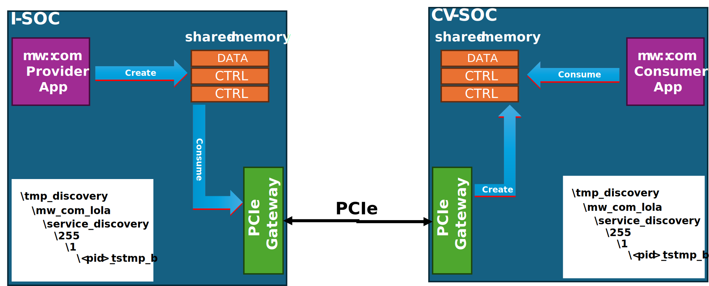
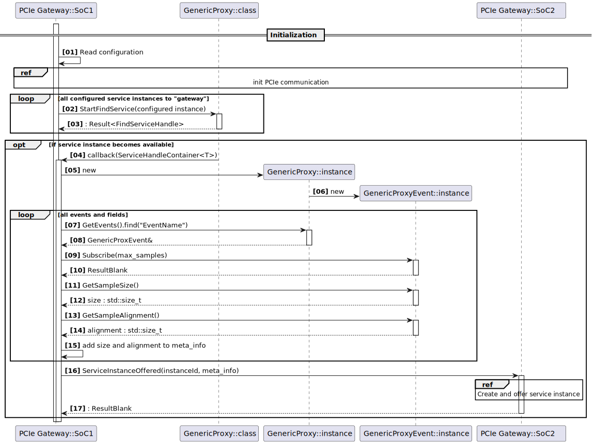
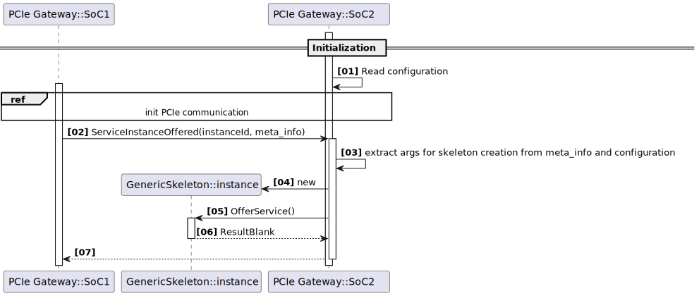
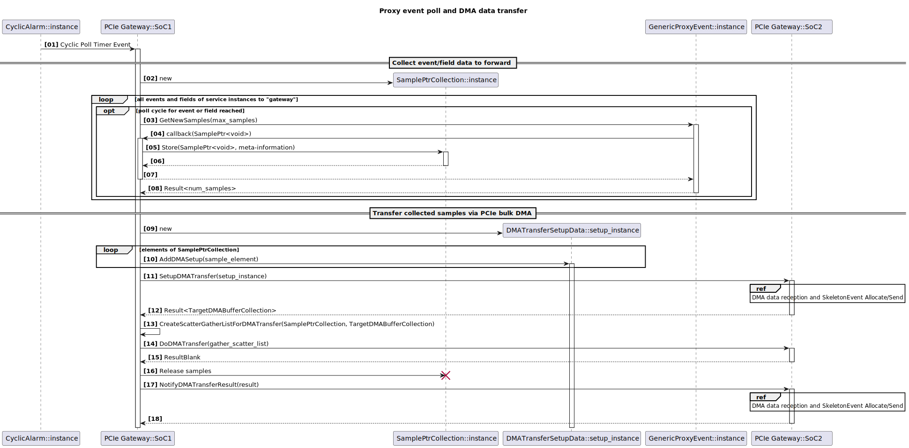
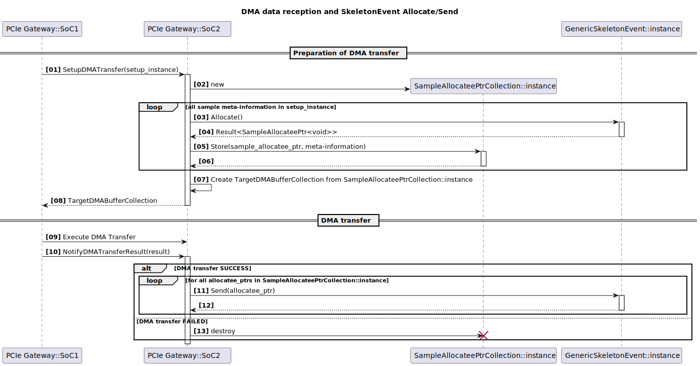

# Concept for a LoLa PCIe Gateway

## Intro

Given, there are two SoCs that want to communicate together via PCIe.

On both SoCs, `mw::com` will be used as the SoC local
IPC mechanism using its zero-copy shared-memory binding (`LoLa`).
We also want to enable, that a given service instance provided on one of the SoCs can not only be consumed by clients
within the same SoC (QNX instance), but also by clients on the other SoC.

This shall be realized by transferring the data, which the service instance within one SoC provides to the other SoC via
PCI Express (PCIe).

Both SoCs do have their local memory and their own OS instances. So, there is no shared-memory between both. This means,
that the data has to be copied via PCIe from the memory of the 1st SoC to the memory of the 2nd SoC. Therefore, the
communication between `mw::com` applications using the `LoLa` (shared-memory) binding between the different SoCs is not
zero-copy anymore opposed to a SoC local communication. The transfer via PCIe means one additional copy.

The copying of data provided by a service instance on one SoC to the other over PCIe is done via efficient DMA transfer.
Normally the throughput increases with larger chunks being transferred.

We will try to keep this behaviour into account and will come back to this further down within this concept.

## Restrictions

This concept only takes event and field communication into account. Support for service-methods in `mw::com` will be
implemented midterm, so the concept could already foresee this support. However, there would be a lot of added
complexity, so we leave it out for now!

## PCIe Gateway Process

The task to transfer service instance data over PCIe is assigned to our PCIe gateway, which gets instantiated as a
single instance in a specific process per SoC. The reason, that we need a single instance, opposed to implementing this
PCIe gatewaying functionality within each `mw::com` process in the form of a library:

- the PCIe is a single resource, which needs to be managed and accessed in a synchronized way.
- this allows better overall optimization of the data transfers between the SoCs.

The following picture shows a deployment overview, where an instance of the PCIe gateway exists on both SoCs:

### Consumer and Provider Roles

From `mw::com` perspective, the PCIe gateway takes over a service instance consumer and provider role within its SoC
(OS instance):

- Consumer role: For each service instance provided locally within the SoC, which shall be also provided on the other
SoC, the gateway takes over the role of a consumer. Thus, it creates a `mw::com` proxy instance, to "consume" the
locally provided service instance. "Consume" here means roughly: Subscribe to all the events and fields, access the
event and field samples and then forward the sample data via PCIe to the other SoC.
- Provider role: For each service instance provided on the **other** SoC, and where the gateway on the other SoC
forwards sample data via PCIe to the local gateway, the local gateway creates a `mw:com` skeleton instance and offers it.

### Which service instances to gateway

A gateway instance needs to have knowledge, which locally provided service instances, it shall forward to the other SoC.
This means, it needs an explicit list of service instances, identified by `service-type` and `instance-id`, for which it
takes over the role as consumer. Symmetrically, it needs an explicit list of service instances, for which it
takes over the role as provider. How the configuration shall be handled for the PCIe gateway use case is detailed in the
[configuration chapter](#configuration-and-tooling).

### Instantiating a proxy

For all locally provided service instances, for which the gateway takes over the role as a consumer, it instantiates a
corresponding proxy. Since the gateway does **not** semantically interpret the event and field data of the provided
service instance, but "just" transfers "byte arrays" via PCIe, it does **not** need a strongly typed proxy. I.e. a proxy
with strongly typed `ProxyEvent`s and `ProxyField`s.
A `GenericProxy`, which `mw::com` already provides, is a loosely typed proxy and fits exactly to the use case here. The
benefit is, that such a proxy can be instantiated based on deployment info alone. This can be done dynamically during
runtime, **without** the need to recompile the gateway code for each newly introduced provided service type, which it is
going to consume!

The following sequence diagram shows the steps up to the instantiation of a proxy and then also notification of the
gateway on the other side:

### Instantiating a skeleton

Symmetrically to the consuming side, the gateway has to instantiate skeletons for each service instance, it shall
provide locally. I.e. those skeletons, which are the substitutes of the skeletons from the other side (other SoC). Here
the same concept applies like on the consuming side: The gateway does **not** semantically interpret the event and field
data, it provides via these skeletons. Technically it will just send event data or update field data, which it has
received via PCIe from the "real" skeletons on the other side. So, just like on the consuming side, the gateway deals
with "byte-arrays", it has received via PCIe and then publishes it using `SkeletonEvent::Send()` or
`SkeletonField::Update()`.

Unlike on the consuming side, where we can build upon the existing `mw::com::GenericProxy` for this use case, there is
`not yet` a corresponding `mw::com::GenericSkeleton`. But since we have the same requirement here, that we do not want
to recompile the gateway codebase, when we introduce a new service type, which the gateway shall provide locally, we
technically need such a `mw::com::GenericSkeleton`.

#### Extending mw::com with GenericSkeleton class

A newly to be introduced `mw::com::GenericSkeleton` class will be structurally similar to `mw::com::GenericProxy`. Thus,
instead of having discrete members for its provided events and fields, it will have maps, where field and event instances
can be looked up by name during runtime. These instances are then &ndash; similar to the `mw::com::GenericProxy` case
&ndash; typed by either `GenericSkeletonEvent` or `GenericSkeletonField`.

There is some minimal meta-information a `mw::com::GenericProxy` needs about its contained fields and events. Things like
the event or field name, its maximum data size and also its required alignment. Since it intentionally has no type
information about its events and fields, from which it could get this information, it needs to obtain the information
elsewhere. The `mw::com::GenericProxy` looks this information up from shared-memory. The provider side (strongly typed)
skeleton, which creates the shared memory, populates it also with this necessary meta-info for all its events and fields.
So a `mw::com::GenericProxy` looks it up during its creation, where it already accesses the shared-memory created by the
provider.

In the case of `mw::com::GenericSkeleton` we need obviously a different solution. I.e. since this is the provider side,
which creates the shared-memory, it needs this information already on construction. In our PCIe gateway scenario, this
essential meta-info will be provided by the "real" skeleton instance on the providing SoC. The meta-info provided in
the shared-memory will then be read by the provider side PCIe gateway via its consuming `mw::com::GenericProxy` and
communicated to the PCIe gateway on the other side, where then a substitute `mw::com::GenericSkeleton` instance gets
created, getting this meta-information as input. The main information contained in the meta-information is:

- event and field names
- sample sizes and alignments of events and fields

Additional information needed for instantiation of a `mw::com::GenericSkeleton` instance is the following:

- how many slots to allocate for a given event or field
- shall it be ASIL-B or QM only
- what are the allowed consumers (ASIL-B and QM)

Technically, this information can be either part of the meta-information sent via PCIe prior to the instantiation of the
`mw::com::GenericSkeleton` or it can be part of the configuration of the gateway, which is doing the instantiation.
Detailed proposal, how to solve this, will be given in the [configuration chapter](#configuration-and-tooling).

The following sequence diagram shows the steps up to the instantiation of a skeleton triggered by a notification via
PCIe, that a service instance provided on the other side, which shall be "gatewayed", is now available:

### No Gatewaying of service discovery

Both SoCs do have their own `mw::com` domains with their SoC and thus QNX instance local service-discovery, currently
implemented as a directory structure in a temp-filesystem.

As soon as the gateway on SoC A did find a local service-instance, for which it had been [configured](#configuration-and-tooling)
to "gateway" it to SoC B, it will communicate this event via PCIe control channel to the gateway in SoC B. As a result,
gateway in SoC B will create the "substitute" skeleton instance and call `OfferService()` on it. This will lead to
registration of the service-instance in the service-discovery within SoC B. So, afterward the service-discovery in SoC A
and SoC B both contain the same service-instance entry, but both referencing obviously different (local)
service-instances.

**Note**: The "No gatewaying of service discovery" in the chapter heading means: We do not introduce a protocol, where
we automatically forward any `OfferService()` call, done locally on one SoC via our gateways to the other SoC. Neither
do we forward `FindService()` calls done within one SoC to the other! So, we are not introducing a distributed
service-discovery over SoC boundaries, where the local discovery nodes are being synchronized. This would make no sense,
mainly because we do not want this transparency of service availability over SoC boundaries in such a generic way. We
need to explicitly control, which service instances are visible on the other side. And we need to create specific proxy
and skeleton instances in the gateways, which handle the data exchange over PCIe, so that such a generic SoC overarching
discovery would be insufficient.

### Gatewaying event-sends and field-updates

There are conceptually two approaches, when data updates, being done by the original service instance provider, are
forwarded via the PCIe gateway:

- `event-driven`
- `cyclically` (or polling)

The `event-driven` mode requires, that the proxy instances spawned by the gateway on the provider side SoC register
`mw::com` `EventReceiveHandler`. This way the proxy instance gets notified, when the service instance provider did an
event or field update and can thus call `Proxy<Event|Field>GetNewSamples()` in a timely manner to instantly get the
updated samples and transfer the underlying data via PCIe.

Opposed to the `event-driven` mode, the gateway in `cyclically` mode iterates over all the events and fields of the
provided service instances calling `GetNewSamples()` cyclically. So it can be either the case, that for a given event or
field, there is either no new sample at all or there are 1 to N new samples.

The main benefit of the `event-driven` mode is the relatively small latency between an event or field update on one SoC
until it gets visible also on the other SoC.
But it has also some severe downsides:

- usage of `EventReceiveHandler`s on the providing SoC side leads to lots of `message_passing` inflicted context
switches. This can be detrimental for overall performance on the provider side.
- we would need to set up a PCIe data transfer per each updated event or field sample. This means lots of rather small
transfers. Even without having already tested it: Setting up few, but larger scatter-gather transfers, which PCIe allows,
seems to be clearly superior regarding throughput.

There is also a third option on the table: Explicitly trigger the gateway to forward specific event or field updates to
the other side. This application driven update makes very much sense, when at a certain point in time at provider SoC
side a known update of a certain amount of fields or events has happened. Then specifically triggering the update might
be very effective and have some benefit over both other solutions above. So we add here:

- `trigger synchronization-group`

i.e. we foresee configuring so called `synchronization-group`s, which means, that you can assign fields and events of
service instances to arbitrary named `synchronization-group`s. And then the gateway provides a trigger-API, where you
hand over the `synchronization-group` name, which leads to forward the updated data of the events or fields contained in
the given `synchronization-group`.

So in this concept, we propose to implement all of these 3 variants. Which one is chosen for a specific event or
field instance is set in the configuration.

Here are the steps taken on the gateway on provider side, when adata forwarding a given event or field instance is due:

1. call `GetNewSamples` with a specifically configured `max_samples` number.
2. collect the `SamplePtr`s returned via callback plus the needed meta-information like `service-id`, `instance-id`,
  `element-id`.
3. Prepare the DMA-transfer to the other SoC:
   1. Send a message via PCIe to the other SoC containing the collected meta-information of samples to be forwarded.
   2. Receive a reply-message via PCIe from the other SoC containing target DMA buffer IDs for the samples to be forwarded.
   3. Setting up scatter-gather DMA-transfer lists containing for each sample to be forwarded, the local DMA buffer, the
   remote DMA buffer and the size.
4. Execute the DMA-transfer with the previously prepared transfer list.
5. Send a final message to the other SoC about the outcome of the DMA-transfer
6. Release the collected `SamplePtr`s

The receiving gateway side is triggered by the provider side step (3.i), where it gets informed about which event or
field samples the provider wants to transfer in the current cycle. So receiving side steps from this point onwards are:

1. Receive the DMA-transfer prepare message, which contains the meta-information of all the samples to be sent.
2. Identify the skeletons and its contained events or fields corresponding to the received meta-information. The
   skeletons have been already [instantiated](#instantiating-a-skeleton) in the initialization phase of the receiving
   gateway.
3. Call `SkeletonEvent::Allocate()` or `SkeletonField::Allocate()` for each sample announced in the DMA-transfer prepare
   message.

   **Attention**: If we want to enable multiple updates for a specific event or field instance within one DMA-transfer
   due to massive batching, we have to explicitly foresee such a support for our `SkeletonEvent` and `SkeletonField`
   classes!
   Currently, we are working on "refined" `GetNewSamples` API signatures with replacement `SamplePtr` candidates, were
   support for multiple parallel allocations might be prohibitive!
4. Send back a PCIe reply message for (1), containing the DMA buffer IDs identifying the allocated sample buffers from
   step (4), where the DMA transfer shall copy the sample data.

## Lifecycle Management

Both SoCs &ndash; the SoC1 and the SoC2 &ndash; have distinct lifecycles. The SoC1 can be seen as the master in the
sense, that he is always there/alive, when the SoC2 is there. But not the other way round: The SoC2 will be shutdown
and restarted, while the SoC1 is alive.

This has the following impact:

- We don't want to unnecessarily collect sample data on the SoC1 side for transfer to the SoC2, if SoC2 is not there
- When the SoC2 shuts down, we want to stop offer any service instance, provided by the SoC2 and forwarded to the SoC1.
  - This will happen regularly (normal shutdown) via a stop offer done by the SoC2 side provided service-instance.
    This will be detected by the [instantiated proxy](#instantiating-a-proxy) on the SoC2 side gateway, which then
    will inform the SoC1 side gateway about this change, which then in turn will stop offer its local service-instance
    representation.
  - But we want this stop offer also to happen, when the SoC2 side **crashes** and thus the regular stop offer
    forwarding didn't happen.
  - The basic initialization of the PCIe communication between both SoCs might need to get re-initialized on both sides,
    even if just the SoC2 did restart. This we will have to find out during our PoC development.

To tackle all these topics, we foresee a state-machine in each gateway instance, which keeps track about the "aliveness"
of the other SoC and the status of the PCIe connection. Since the lifecycle of both SoCs is slightly different, also the
corresponding state-machines will eventually deviate.
For example: From the perspective of the SoC1, it can be a normal mode, that the SoC2 is currently down, while from
the SoC2 perspective, the SoC1 being down is clearly an error situation.
How these state-machines differ needs to be defined in the detailed design. The specifics about (partial) PCIe
re-initialization, which need to be analyzed in the PoC and were mentioned above, will have an impact on the state-machine
design.

### Heartbeat mechanism

As part of this concept, we propose to have a "heartbeat" mechanism between both SoCs on PCIe:
The gateway on the SoC1 **cyclically** sends a PCIe message to the SoC2 and expects a reply. The gateways on both
sides feed their state-machines with the outcome of these cyclic messages:

- SoC1:
  - an error sending heartbeat message triggers a state-machine event
  - not getting the reply message in-time triggers a state-machine event
  - getting the reply message in-time triggers a state-machine event
- SoC2:
  - not getting the heartbeat message in-time triggers a state-machine event
  - an error sending reply message triggers a state-machine event
  - successfully sending reply message triggers a state-machine event

The main arguments for having this heartbeat mechanism running in the background, opposed to detecting PCIe communication
issues "on demand", when a service-instance specific PCIe communication fails, are:

1. When we detect a PCIe communication issue, which needs some re-initialization on one or both sides, we will have
   potentially a lower latency healing the problem and thus might lose  fewer samples.
2. If we already know, that the other side is down, we don't waste resources to collect samples locally to forward to
   the other SoC at all. We then start collecting again, when the heartbeat works again (which is reflected in the
   state-machine).
3. Gateway in consume only mode &ndash; this means it only gets sample updates from the other SoC to publish locally,
   but does **not** send sample updates to the other SoC &ndash; can't distinguish between broken communication from a
   state, where simply no data updates are happening and thus can't react accordingly.

The cycle time of the heartbeat shall be configurable.

## Threading

A gateway instance needs semantically at least three "worker" threads to drive its actions:

1. A thread, which polls for local event and field updates for all the [instantiated proxies](#instantiating-a-proxy)
   and then issues the DMA batch-transfer of the new samples.
2. A thread, which listens for PCIe messages received from the other SoC. We distinguish the following messages:
   - message to notify about the availability or disappearance of a service-instance
   - message to set up a DMA transfer for samples to be sent from the other SoC to this SoC
3. A thread handling the heartbeat mechanism.

In a concrete implementation, some of these threads aren't either necessary or can be combined into one:

- in case the gateway has no service-instances to forward to the other gateway, but just consumes service-instances from
  the other side, thread (1) isn't needed.
- thread (1) for the sample polling and thread (3) for the heartbeat handling could be combined on the SoC1 side, given
  that the cycle time can be adapted to serve both purposes.

## Configuration and Tooling

### Basics

Introduction of a PCIe gateway, which shall "forward" specific local service-instances to the other SoC has an influence
on the configuration of the specific local provided service-instances.

This is due to the fact, that the gateway is acting as an additional consumer of these specific local service-instances.
More specific: Of the events and fields of these service-instances.
Therefore, configurations of provided service-instances, which get consumed by the gateway need to adapt their event or
field specific settings:

- `maxSubscribers`
- `numberOfSampleSlots`

To make it "transparent" configuration-wise and separate configuration of PCIe gateway aspects from "normal" consumers,
we propose **not** to simply increment `maxSubscribers` by one, for each event and field of PCIe "forwarded"
service-instance, but to use new configuration properties instead! This is by the way also symmetrical with the approach
chosen for `IPC-Tracing`, where we also introduced specific properties like `numberOfIpcTracingSlots`, instead of
requiring the users to add IPC-Tracing related slots to the general `numberOfSampleSlots` property!

The positive side effect of this approach to have PCIe gateway use case specific properties for (provided)
service-instances is, that we don't need any redundant configuration for the PCIe gateway.
The `mw::com` configuration (`mw_com_config.json`) needed for the PCIe gateway itself can be generated out of all the
`mw::com` configurations of applications local to the PCIe gateway, which provide service-instances, which shall be
"forwarded" via PCIe.

### New configuration properties

For the PCIe use case the following properties will be added to the json configuration object within
`serviceInstances.instances` array. These new properties are only valid in case the configuration object has the property
`binding` set to `SHM` and it is only relevant for the role as a service provider (skeleton side).

- configuration object within the `events` or `fields` array gets new optional property `PCIeGateway`, which is of json
  object type. This json object has the following mandatory properties:
  - `numberOfGatewaySlots`: This number gets implicitly added to the
    `numberOfSampleSlots` of the enclosing event or field. So exactly the same approach as with
    `numberOfIpcTracingSlots`, which also gets added to calculate the final number of sample slots to be allocated in
    shared-memory. It reflects the additional number of slots the PCIe gateway may use as a consumer of this event or
    field. The minimum value is `1`. Larger values might be needed, when the event or field production rate is high, so
    that the gateway is not able to keep up with its configured polling cycle (see below) and no samples shall be lost.
  - `numberOfGatewayRemoteSlots` : this is a property forwarded via PCIe to the remote gateway to allow correct
     instantiation of skeleton at the other SoC (see [here](#forwarding-of-skeleton-configuration-parameters-via-pcie))
  - `maxSubscribersGatewayRemote` : same mechanism as property above.
  - `allowedConsumersGatewayRemote` : same mechanism as property above.
  - `dataForwardingMode` : one of either `EventDriven`, `CyclicPolling`, `TriggerSyncGroup`.
  - `CyclicPollingCycleTime` : needed only in case `dataForwardingMode` set to `CyclicPolling`. Gives the poll cycle time.
  - `TriggerSyncGroupName` : needed only in case `dataForwardingMode` set to `TriggerSyncGroup`. Name of the
    `synchronization-group` by which data forwarding of this event or field can be triggered.

### Forwarding of skeleton configuration parameters via PCIe

We propose a further optimization of the configuration in the sense, that we want to have the single truth at the
configuration of the provider side and the minimum amount of generated PCIe gateway configuration:

The [previous chapter](#basics) explained, how we can deduce the PCIe gateway `mw::com` configuration regarding its role
of a consumer of local service-instances, which it shall forward/expose the other SoC. This basically deduces, what proxy
instances it shall create, how frequently it shall poll for new samples and with how many samples it shall subscribe.

But this is only half of the way. On the other SoC the PCIe gateway then has to take over the role as the provider again,
by [instantiating a skeleton](#instantiating-a-skeleton) in the form of a `mw::com::GenericSkeleton` as described
[here](#extending-mwcom-with-genericskeleton-class). For creation of such a skeleton the PCIe gateway also needs certain
configuration info. The necessary type related meta-info for the `mw::com::GenericSkeleton` instantiation needs to be
transferred via PCIe from the SoC, where the "real" providing service-instance is located anyhow according to the
[GenericSkeleton specific chapter](#extending-mwcom-with-genericskeleton-class).
While this type related meta-info is no configuration info in the sense of deployment information contained in a
`mw::com` configuration (`mw_com_config.json`), there is nothing wrong with letting the PCIe gateway on the one SoC,
which already sends the type related meta-info to the other gateway also send additional deployment info for this
`mw::com::GenericSkeleton`! This enables the gateway on the other side, to instantiate its corresponding
`mw::com::GenericSkeleton` just from information transferred over PCIe without any configuration artefacts within its
local gateway specific `mw::com` configuration.

The required configuration or deployment info, the "substitute" `mw::com::GenericSkeleton` needs for correct
instantiation contains the following properties, which are extracted from the gateway configuration on the providing
side and then transferred over PCIe to the other side:

- `service-id` : comes from the same property of the configuration of provider side gateway
- `instance-id` : comes from the same property of the configuration of provider side gateway
- `version` : comes from the same property of the configuration of provider side gateway
- for each of its events and fields:
  - `eventName` : this might be already contained in the type related meta-info.
  - `numberOfSampleSlots` : determined from the `numberOfPCIeGatewayRemoteSlots` property of the configuration of
     provider side gateway
  - `maxSubscribers` : determined from the `maxSubscribersPCIeGatewayRemote` property of the configuration of provider
    side gateway
  - `allowedConsumer` : determined from the `allowedConsumersPCIeGatewayRemote` property of the configuration of
     provider side gateway

### Configuration constraints

There are some general constraints related to configuration:

- we do not support IPC-Tracing at all for proxies and skeletons created by PCIe gateways! These are only technical
  entities for "gatewaying" mw::com communication over PCIe. IPC-Tracing shall only be done by user instantiated proxies
  and skeletons.
- Skeletons in the form of `mw::com::GenericSkeleton` always have the event or field specific property
  `enforceMaxSamples` set to TRUE! Reason: This property can only be set to FALSE, when the user has total control over
  scheduling of the provider side event or field update and the scheduling of the corresponding consumers! But the
  scheduling of the gateway created skeletons and their event or field update behaviour is not under user control.
- If there is at least one event or field of a service-instance configured with the optional property `PCIeGateway`,
  this means, that the enclosing service-instance shall be forwarded via PCIe gateway to the other SoC. And this also
  requires, that all events and fields need this `PCIeGateway` property. Reason: A service-instance has to be complete.
  I.e. if it is forwarded/"gatewayed" to the other SoC, it has to provide the same signature as the "original" instance.

### Generation of mw::com configuration for PCIe Gateway

As introduced in the [configuration basics chapter](#basics), the configuration for a PCIe gateway instance can be
generated from all the `mw_com_config.json` files of `mw::com` apps deployed on the **same** SoC as the gateway.

The generator extracts all service instances, which contain a `PCIeGateway` property and are therefore
"gateway relevant". These are the locally provided service instances, which the gateway shall forward and thus
instantiate proxies for it. So the generator generates the following artefacts from the inputs into the gateways
`mw_com_config.json`:

- The service-types in the `serviceTypes` section of the gateway configuration get generated from all the service-types
  in the input files, which are referenced by "gateway relevant" service-instances one-to-one.
- The service-instances in the `serviceInstances` section of the gateway configuration get generated from all the
  service-instances in the input files, which are "gateway relevant". Here it is sufficient to take over the properties
  of the service-instances, which are required for the consumer role
  (see configuration documentation)
  plus the `PCIeGateway` property objects as the gateway needs only to be able to generate proxies (consumers) for it.

**Attention**: This very "minimalistic" configuration approach for the PCIe gateways requires deployment-configuration
transfer over PCIe, which has been described in [this chapter](#forwarding-of-skeleton-configuration-parameters-via-pcie).
If this approach is **not** taken, the generation of the `mw::com` configuration gets more complex, because then also
information of service-instances, which shall be provided by the gateway (the substitutes for the original provider on
the other SoC) needs to be generated.

## Safety considerations

We also want to support `mw::com` communication over PCIe for ASIL-B applications.
So we have to take a closer look at the communication specific faults, which we have already solved for `mw::com` with
`LoLa`/`shared-memory` binding, but need to be reevaluated, when we introduce a PCIe gateway.

Most likely we need to create specific FMEAs for these faults.

- `Repetition of information`: This could be inflicted by our gateway implementation. E.g. it could falsely double
  transfer a sample via DMA. This has to be solved by implementing and testing the gateway implementation according to
  our safety requirements.
- `Loss of information`: This is most likely the hardest topic to solve! In our current `LoLa`/`shared-memory` binding
  implementation, a potential data loss can be detected by a consumer by a defined slot number configuration combined
  with a `max_samples` subscription setting. As specified in our AoU this means: If a consumer updates its samples and
  gets `max_samples` back, then a potential overflow/data-loss might have happened.

  In the PCIe gateway case this is `different`. The gateway [instantiated proxy instance](#instantiating-a-proxy), which
  collects the samples from the local provider needs to detect a potential sample loss with the same paradigm we
  document in our AoU. But after having done this detection, we need a **specific** mechanism to forward this data-loss
  information to the remote PCIe gateway. While we most likely will do with a control message, we send via PCIe, the
  challenge is then to further propagate this information to the end-user. I.e. the final proxy instance spawned by the
  user, which consumes the data, which the gateway instantiated skeleton did provide.

  For this we currently do have **no** solution on `mw::com` public API level. The "straight forward" solution would be
  to introduce additional meta-information to the existing public API. I.e. `GetNewSamples()` could provide additional
  information like a data-loss indicator. This kind of enhancement is similar to `E2E`-extensions defined in `ara::com`
  (AUTOSAR communication API). Maybe it really makes sense then to design such a generic `E2E` like extension also for
  the `mw::com` API, which then is also prepared for further bindings, which need fully fledged `E2E` state-machines in
  case the underlying transport is an untrusted "grey-channel".
- `Insertion of information`: This has to be solved by implementing and testing the gateway implementation according to
  our safety requirements.
- `Masquerading`: This would mean, that the PCIe gateway, which takes over the provider-role of the "gatewayed"
  service-instances for its SoC, would provide them under a faked `uid` instead of its own publicly known `uid`. This can
  be solved by not giving the PCIe gateway `setuid` rights.
- `Incorrect addressing`: This is not a topic for our event and field communication, as there we aren't addressing a
  specific consumer. The consumer is actively accessing the specific service-instance, he requires.
  However, what needs to be assured by the PCIe gateway (rather a mixture of `Masquerading` and `Incorrect addressing`):
  It needs to offer a "gatewayed" service-instance exactly under the same `service-id` and `instance-id` as the original
  provider did. This means, that we have to assure, that this identification is transferred unmodified from the provider
  side gateway to the consumer side gateway and the consumer side gateway then offers its substitutes
  (`mw::com::GenericSkeleton`s) exactly under these unmodified `service-id`s and `instance-id`s. Also, the
  identification of events and fields within the shared-memory set up by the substitutes, shall be unmodified.
  This has to be solved by implementing and testing the gateway implementation according to
  our safety requirements.
