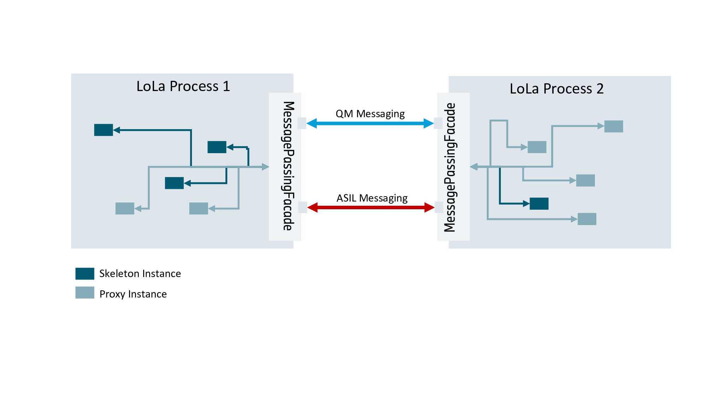
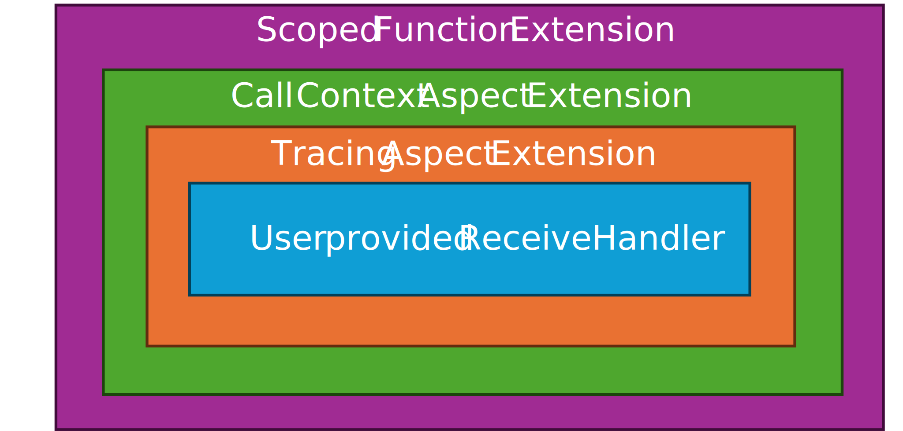

# Event/Field communication in `LoLa`

## Introduction

Events and Fields in `ara::com` are class templates parameterized with the `SampleType`. They differ between provider
(skeleton) and consumer (proxy) side regarding their functionality.
`ara::com` proxies and skeletons contain members of the related template classes. The binding independent structural
model/class diagram is discussed in
[Skeleton/Proxy Binding architecture](../skeleton_proxy/README.md)

## Field as a composite

A field in ara::com is semantically an event, with some additional properties:

- it always has a value. I.e. also during creation/offering of a field on the provider (skeleton) side an initial value
  has to be provided. This also leads to the assurance, that on consumer (proxy) side after subscription a valid field
  value can be retrieved.
- it has optional getter/setter methods on the consumer (proxy) side. I.e. the latest field value can be retrieved
  "on-demand" (get) on the consumer side (whether this really makes sense/is added value depends on the binding specific
  implementation of events). The "setter" (if configured for a field) would allow the change of the field value by a
  consumer.

Therefore, we decided to realize a field on the **binding independent** level as composition of an event and
service-methods for set/get. Since we don't have implemented service-methods yet, the latter are "placeholders".

The related field classes and their composite nature can be seen in the class diagram of the proxy/skeleton design
chapter [here](../skeleton_proxy/README.md#introduction).

### Skeleton side

On the skeleton side, we have `impl::SkeletonField<SampleType>`, which is just like `impl::SkeletonEvent` a class
template, with the `SampleType` (type of event/field value) as template argument. It inherits from
`impl::SkeletonFieldBase`, which reveals the composite nature, because it aggregates via member
`skeleton_event_dispatch_` the `impl::SkeletonEventBase`, where it dispatches all its event specific behavior parts to.
As soon as we have impl::SkeletonMethodBase. the `impl::SkeletonFieldBase` will be enriched with optional members
`skeleton_method_get_dispatch_`/`skeleton_method_set_dispatch_`!

### Proxy side

The field implementation on the proxy side looks similar to the skeleton side: We have `impl::ProxyField<SampleType>`
class template (just like `impl::SkeletonField<SampleType>`), but in this case there is no base class!
`impl::ProxyField<SampleType>` directly aggregates the event specific dispatch target with its member
`proxy_event_dispatch_` of type `impl::ProxyEvent<SampleType>`.

### Event constructor extensions

On both sides, we do have specific `ctor`s (`impl::SkeletonEvent` and `impl::ProxyEvent` for creation of events in
the field context, as there are minimal differences in behavior.
E.g. on the proxy side, we need the "hint", that an event is created in the field context, to look up correct (field
specific) configuration for `IPC-Tracing`. Same applies for the skeleton side. Additionally, the `ctor` of an event
normally registers itself at its parent skeleton in its event-collection. This is bypassed in the specific ctor for
the field use case as in this case the `impl::SkeletonField<SampleType>` has already registered itself in its parents
field-collection!

## Event related datastructures in LoLa binding

Here we provide insight, how event communication is realized within our `LoLa` (shared memory based) binding. The
following class diagram shows LoLa specific binding implementation and its relationship with binding independent parts:

The referenced class `SubscriptionStateMachine` within this model is further detailed (including its dependent entities)
further [below](#event-subscription).

We use two different event related data structures, which get placed in shared memory:

1. `EventDataStorage<SampleType>`: Basically a vector (aka storage slots) of the raw event data of SampleType.
2. `EventDataControl`: Control structures, which maintain a specific state for each storage slot.

The reason for dividing this event related information into separate data structures stems from our need to support
safety critical setups! While `EventDataStorage<SampleType>` needs only be writeable by the skeleton instance, we can
put it into one single shared memory object, which gets mapped read-only by all subscribing proxies, independent,
whether they are ASIL or QM qualified. For `EventDataControl` things are different: This data structure has
to be r/w for all participants (skeleton, QM proxies, ASIL proxies). Therefore, we have to partition it into a different
shared memory object, which is r/w accessible by **all** participants. Moreover - in specific setups, where we have an
ASIL provider and both - ASIL and QM consumers, we need two instances of `EventDataControl`. One for the
ASIL participants and one for the QM participants to guarantee freedom from interference.

There is an intrinsic relation between `EventDataControl` and `EventDataStorage<SampleType>`, namely between
their members `event_slots` and `state_slots`! Both are vectors of the exact same size! While `event_slots[i]` contains
the data of a specific event sample, `state_slots[i]` contains state information for exactly the same slot.

### Sizing of `event_slots` and `state_slots` vectors

How many `storage slots` are needed to hold event sample data within the `EventDataStorage<SampleType>` instance and its
corresponding `EventDataControl` instance(s), depends on the number of subscribers (proxies) and the
value/number for parameter `maxSamples` they specified in their subscription.

The concrete formula is:
`num storage Slots` = 1 + Sum of maxSamples of all subscribers

Since the presence of consumers can change dynamically during runtime (they can show up and subscribe and unsubscribe
again), the number of needed `storage slots` is fluctuating. Since a fully dynamic number of `storage slots` (
allocation/deallocation)
during runtime is detrimental to very efficient lock-free data structures and algorithms, we are going to use, we will
**pre-allocate** a configurable maximum number of `storage slots` in `EventDataControl` and
`EventDataStorage<SampleType>` at the time, where they get created by the service instance.

Whether the pre-allocation wasn't sufficient, would be detected during runtime, when a new consumer tries to subscribe
to the event with a certain value of parameter `maxSamples`, which can't be fulfilled by the pre-allocation. The
subscription of the consumer would fail. This can then be fixed in integration by extending the configuration for max
pre-allocation of `storage slots`.

**Note**: The calculation of `num storage Slots` is up to the user. The number of slots actually allocated is exactly equal
to the value specified in the configuration. Therefore, if the user wants to use the formula above, they have to do it themselves
and set the result of that calculation in the configuration.

### Lock-free/non-blocking access to control data

Since `EventDataControl` instances get concurrently accessed in a r/w manner from skeleton and proxy
instances, the central member`state_slots` has been designed for concurrent lock-free access based on atomics.
Essentially we have the following concurrent r/w accesses here:

* Skeleton allocates/sends or simply sends a new event sample.
* Proxy searches' event(s) with timestamp > refTimestamp and increments slot refcount.
* Proxy dereferences refcount of a sample/slot.

The `state_slots` uses `std::atomic<EventSlotStatus::value_type>`. So `EventSlotStatus::value_type` is designed to be lock-free
on 64-Bit platforms!
I.e.`std::atomic<EventSlotStatus::value_type>::is_always_lock_free` has to return `true`. Otherwise, our concept would not work well!
The member `timestamp` in `EventSlotStatus` is overloaded, since there are specific values, which are not
interpreted as real timestamps, but as markers, whether this slot has not yet any valid sample data (data invalid) or
whether it is currently blocked in a write-state as the slot has been currently handed out to skeleton application layer
in the form of an `score::mw::com::SampleAllocateePtr`, where the application is currently busy creating event data using
the zero-copy path of the `ara::com` event API.

Based on this control data design, the concurrent functionalities mentioned above can be implemented lock-free, just
using
`std::atomic::store`, `std::atomic::load`, `std::atomic::compare_exchange`.

Note: We intentionally left out ordering/sorting of those `state_slots` vectors! Although at first glance it would be
useful (skeleton allocation and proxy event search would benefit from an ordering by timestamp), it could **not** be
done lock-free[1](#lockfree). So we plan to optimize more aggressively regarding space
consumption and compactness of the
`state_slots` vector! The elements of `state_slots` (std::atomic<EventSlotStatusType>) are roughly 5 bytes in size. A
typical cache line of 64 Byte could hold roughly 12 elements. We do not expect `state_slots` vectors with more than 50
elements. Typically, much less! This means that we should in our case have extreme cache locality! Just using/scanning a
few cache lines anyhow, which should be blistering fast (will be benchmarked).

#### Slot access in mixed-criticality setup

The basic lock-free algo for a skeleton instance to search for a "free" slot in the context of a Send/Allocate call is:

Go through the elements in the `state_slots` vector and check, whether the slot is either empty (invalid timestamp) or
whether it has a ref_count of 0 and has the lowest/oldest timestamp of all slots with ref_count 0. If it has found such
a slot, it "occupies" it with a compare_exchange() operation (to shield against ref_count changes, which have happened
in between) by setting the timestamp to the special "blocked" value. If the `compare_exchange` detects a change, the
search has to start again.

Things get a bit more complex in mixed-criticality setups. Here the skeleton instance has to apply the "free" slot
search in two different `EventDataControl` instances. One in ASIL-QM shared-mem-object and one in ASIL-B
shared-mem-object. The adaption of the shown algo is as follows:

- the skeleton starts with the algo from above in the ASIL-B `EventDataControl` first.
- If it has found/blocked a slot successfully, it tries to acquire the same slot/index in the ASIL-QM
  `EventDataControl`. I.e. the corresponding slot needs to have also ref_count 0!
- If it can't acquire the slot in the QM section successfully, it has to unblock the slot in the ASIL-B section and
  restart from scratch.
- It should have a max. number of retry cycles. If after this cycle number no slot could be blocked, this is a sign,
  that the QM consumers did corrupt the QM section. In this case the ASIL skeleton should ignore/dump the QM section and
  just fall back only on searching/blocking in the ASIL section.

The cost in memory for typical generic lock-free queues/vectors, which rely on copying and versioning far outweighs the
benefit. [↩](#lockfreeref)

### Realization of `SamplePtr` and `SampleAllocateePtr`

`ara::com` defines two `std::unique_ptr` like pointers for accessing sample data of an event:

* `score::mw::com::SamplePtr` is the smartpointer used on the proxy side to access an event sample
* `score::mw::com::SampleAllocateePtr` is the smartpointer used on the skeleton side in case of usage of the zero-copy API
  path to fill event-data "in-place".

Our implementation of `score::mw::com::SamplePtr` resp. `score::mw::com::SampleAllocateePtr` hold a binding specific
implementation of such a smartpointer. So in case of `LoLa` binding, we have `lola::SamplePtr`
/`lola::SampleAllocateePtr`, which both hold an implicit (via `lola::SampleAllocateeDeleter`
resp. `lola::SampleDeleter`) reference to `EventDataControl`. This reference is needed as the
deleters (`lola::SampleAllocateeDeleter`, `lola::SampleDeleter`) alter state of event slots in
the `EventDataStorage<SampleType>` (decreasing refcount or state/timestamp change).

### Skeleton side Activities for Event Access

The API entry point to events on the server/skeleton side is

- either the `Event::Send(SampleType&)` API
- or the `Event::Allocate()`/`Event::Send(SampleAllocateePtr<SampleType>&&)` API combination

In any case a memory-allocation (rather a free event slot search) needs to be done. The general activity to be done in
this case is pictured in the following activity diagram:

In case of a mixed criticality setup with an ASIL-B provider/skeleton and both - ASIL-B and ASIL-QM consumers, where
discrete control structures are needed to separate ASIL-B/QM, the activities to be taken by the ASIL-B skeleton are as
follows:

During this activity a more complex sub-activity is executed/referenced, to achieve a coherent change of slot states in
both control structures (containing a rollback mechanism). This activity is modeled separately here:

### Proxy side Activities for Event Access

The central API entry point at proxy/consumer side to access event samples (after a successful subscription) is the
`GetNewSamples()` method of an event instance. The activities taken by the proxy side implementation are as follows:

The activity shown above thereby relies on activity `ReferenceNextEvent`, which is shown here:

The main proxy algorithm above the shared memory data structures is broken into three entities:
`score::mw::com::impl::lola::ProxyEvent`, `score::mw::com::impl::lola::ProxyEventCommon` and `score::mw::com::impl::lola::SlotCollector`.
While `ProxyEvent` is a type-aware templated class, `ProxyEventCommon` and `SlotCollector` are both type-agnostic. All ProxyEvent
functionality that doesn't require awareness of the type or direct interaction with shared memory are dispatched from `ProxyEvent`
to `ProxyEventCommon`. `SlotCollector` operates on the shared memory control structure without knowledge of the actual type.
`ProxyEvent` implements the functionality (including direct interaction with shared memory) that require awareness of the type.
Making `ProxyEventCommon` and `SlotCollector` type-agnostic results in a slight build time benefit since type-agnostic code doesn't
need to be instantiated-then-merged by the build toolchain as this would be the case if that code was part of the templated class.

## Notifications between skeleton and proxy

As per `ara::com` spec, there are several notification like interactions between proxy and skeleton. E.g., proxy
instance allows to register an event specific callback, which gets invoked as soon as the skeleton side has updated this
event (sent a new sample). You see the according methods in `lola::ProxyEvent::SetReceiveHandler` and
`lola::SkeletonEvent::notifyRegisteredReceiveHandlers` (which gets called in the context of `lola::SkeletonEvent::Send`)
. How this interaction between `lola::SkeletonEvent` and `lola::ProxyEvent` instance, which are typically living in
different processes, is technically solved, is an implementation decision! There are two pragmatic options:

1. Also use the `EventDataControl` data structure within the shared-mem object, which is already used for
   the mutual update/sync of event slot states. I.e. extend `EventDataControl` with some kind of
   interprocess mutex and notification mechanism.
2. Use a different sideband channel/IPC mechanism the target OS provides, which might be even better suited than
   solution 1.

Solution 1. has the benefit of being **portable** among our POSIX targets, because it is just relying on POSIX
shared-mem functionalities. But the devil is in the detail of a complex implementation:

- a posix interprocess-mutex is not really cheap as it uses at least `futex()` syscalls on both ends (notifying and
  waiting side)
- Granularity of waiting/notification:
    - The "natural" design might be, to have one mutex per `lola::SkeletonEvent`. But this would also imply, that you
      have overall (per process or entire system) a potentially **awful large size** of threads waiting on the
      connected `lola::ProxyEvent` instances side (note, that we often have 1:N communication for events!). This might
      get out of hands quickly regarding resources.
    - You could/should fix that by creating mutexes on a higher/more coarse grain level. F.i. one mutex for all events
      of a
      `lola::Skeleton` instance. In this case some **additional complexity** comes up, which needs to be mastered:
      Before the skeleton instance notifies this mutex (which now represents update notification of multiple event
      instances), it has to somewhere place within the `EventDataControl`, which event got updated (kind of
      a condition variable). And since updates can happen concurrently/in parallel for several events it rather gets a
      complex, list like condition variable, where you need synchronized (lock-free?) access from different threads (
      threads creating new events on skeleton side, notified/woken up threads on proxy side).

The sideband channel in solution 2. could be implemented "portable" by using a POSIX standardized mechanism (e.g. a unix
domain socket). The benefit opposed to solution 1. would be, that it allows to combine a message channel, where the info
about the affected event can be transmitted with a built-in notification mechanism. When using OS specific optimized
mechanisms (e.g. QNX messaging/pulses) the solution would be even more efficient! Most likely more efficient than
solution 1, even if we invest man-months for creating sophisticated lock-free condition variables!

So right now we decided to use a separate message-passing mechanism implemented in `score::mw::com::message_passing` for
the following proxy/skeleton notification/interaction use cases:

- `lola::ProxyEvent` subscribes at `lola::SkeletonEvent` (Not true currently! `Subscribe` is now done directly by the
  `lola::ProxyEvent` updating a variable of type `EventSubscriptionControl` located in shared-memory. This brought up
  issue Ticket-174759, which eventually will bring us back to use `message_passing` (in a revised form) for subscribe
  again.
- `lola::ProxyEvent` unsubscribes at `lola::SkeletonEvent` (Not true currently, see above!)
- `lola::ProxyEvent` registers a notification on event update.
- `lola::ProxyEvent` unregisters a notification on event update.
- `lola::SkeletonEvent` notifies registered event notification.

The first interaction is more complex as it is an `RPC` like interaction and not a simple uni-directional message.
Our new `message_passing 2.0` under `aas/lib/message_passing` does support RPC style communication, which we will use,
once we resort back to sideband channel communication for `Subscribe` and `Unsubscribe`.

We encapsulate the low-level mechanisms provided by `score::mw::com::message_passing` via
class `lola::MessagePassingFacade`, which is shown in the following class model:

### `lola::MessagePassingFacade` is a Smart Proxy

All messaging interactions between the LoLa proxy/skeleton instances of two different LoLa enabled processes are routed
through their single/per process `lola::MessagePassingFacade` instances:

As such a smart-proxy, the `lola::MessagePassingFacade` will not blindly route messages from proxies/skeletons from one
LoLa process to proxies/skeletons at the other side one-to-one!

Example: If there are two proxy instances within LoLa Process 1, which want to get notified about an update of the very
same event, which is provided by a skeleton instance in LoLa Process 2, then the `lola::MessagePassingFacade` in Process
1 is smart enough, not to send this `RegisterEventNotifierMsg` twice to the `lola::MessagePassingFacade` in Process 2!

**So the general idea is:**
Since we have made the decision, to route the entire message-passing of a LoLa enabled process over one (or two in case
of ASIL) messaging channel to get more flexibility/control over the amount of receiver/listener threads to be used, we
also shall take a further benefit!
That is: This central entity (`lola::MessagePassingFacade`), which cares for the routing, has total overview of the
messaging requirements of its local proxy/skeleton instances and should remove all potential redundancies and thereby
**minimizing the IPC** over `score::mw::com::message_passing` to a bare minimum! Therefore, the notion of **Smart Proxy**.

Technically `lola::MessagePassingFacade` is a combination of a smart proxy and reverse-proxy. But since we have so many
proxies within our `score::mw` implementation, we did not name it as such to avoid further confusion. :)

### Setting up message passing infrastructure

The `score::mw::com::message_passing::Receiver`s used by `lola::MessagePassingFacade` are created/set up during
initialization of our `mw::com` runtime. Depending on the `ara::com`/`mw::com` deployment info for the
executable/process, it can be decided, whether only QM (ASIL-QM) or QM and ASIL (ASIL-B) Receivers are needed.

### Event subscription

Event subscription is technically rather an RPC as already mentioned [here](#notifications-between-skeleton-and-proxy),
because the caller needs a feedback. As outlined above, we are currently **not** using message-passing for `subscribe`/
`unsubscribe`, but this will change **soon** (Ticket-174759). In this case this chapter will get updated accordingly.

#### State machine

Event subscription and the (potentially) asynchronous subscription state change callbacks for a `ProxyEvent` instance
are handled by the `lola::SubscriptionStateMachine`.
The "events" , which drive the state machine transitions are:

- `SubscribeEvent()` - Subscribe-call done by the user
- `UnsubscribeEvent()` Unsubscribe-call done by the user (or implicitly by proxy destruction)
- `StopOfferEvent()` - service discovery induced notification about service instance disappearance
- `ReOfferEvent()` - service discovery induced notification about service instance reappearance

These events can potentially happen concurrently. It is the job of the state machine to synchronize correctly and deduce
a valid state.

How the service discovery related notifications get forwarded to the `ProxyEvent`/its `lola::SubscriptionStateMachine`
instance has been described [here](../skeleton_proxy/README.md#proxy-auto-reconnect-functionality).

The structure and transitions of the state machine are shown in:

The structural model of the state machine design is as follows:

### Event Update Notification

Event Notification is a good showcase for the "smart" behavior of `lola::MessagePassingFacade` as already mentioned (see
example above). Here event notification registrations are aggregated and related messages are only sent once:

#### Managing user provided EventReceiveHandlers

The "Event Update Notification" pictured above in the sequence diagram starts from the point, where the user registers
an `EventReceiveHandler` via `ProxyEvent::SetReceiveHandler`. The user provided `EventReceiveHandler` is an
`score::cpp::callback<void(void)>`, i.e. a "move-only" void callable.

`mw::com` stores this `EventReceiveHandler` in the binding independent ProxyEvent class
(`mw::com::impl::ProxyEventBase`) as member `receive_handler_ptr_`. It does **not** directly store/move it there, but
does the following adaptions:

1. It wraps the `mw::com::impl::ReceiveHandler` eventually into another `score::cpp::callback<void(void)>`, which calls the
   user provided handler and adds [IPC tracing related extensions](../ipc_tracing/README.md#handling-trace-calls). This
   pattern is not `EventReceiveHandler` specific, but is mentioned here for completeness.
2. Then it wraps the handler from (1) (which is either the original `EventReceiveHandler` provided by the user or the
   tracing-enriched version) in an extended handler, which adds an aspect of tracking the current call context. Why this
   is needed is explained [hre](#handler-extension-with-call-context-tracking).
3. Then it wraps the `mw::com::impl::ReceiveHandler` from (2) into a
   [ScopedFunction](../../../../language/safecpp/scoped_function/README.md) `ScopedEventReceiveHandler`, where the scope
   is bound to `mw::com::impl::ProxyEventBase::receive_handler_scope_`

So the resulting handler/callable is basically a composition, which looks like this:

This handler gets then stored within member `receive_handler_ptr_` as a `std::shared_ptr<ScopedEventReceiveHandler>`,
before it gets handed down to the binding specific layer in the form of a `std::weak_ptr<ScopedEventReceiveHandler>`.

Following the explanation, why the different encapsulations/extensions of the user provided
`mw::com::impl::ReceiveHandler` are done and what the `shared_ptr`/`weak_ptr` mechanism adds to the design:

##### Handler extension with call context tracking

We need to handle a call to `ProxyEvent::UnsetReceiveHandler` (or `ProxyEvent::Unsubscribe`, which implicitly also
unsets the `EventReceiveHandler`) **differently** when it is called by the user **within** his provided
`EventReceiveHandler` or **outside**!
Reasoning: When the call to `ProxyEvent::UnsetReceiveHandler` happens outside, then this call 1st must synchronize with
an eventually currently running call by expiring its scope (see next subchapter). And only after it has expired/the call
has ended, the handler can be removed/unset. This is, because we have this contract to the caller of
`ProxyEvent::UnsetReceiveHandler()`, that this function only returns after an eventually running invocation of an
`EventReceiveHandler` has ended.
When the call to `ProxyEvent::UnsetReceiveHandler` happens inside a running `EventReceiveHandler`, then synchronization
via scope expiring is not needed and would lead to a **deadlock**!
The distinction is realized via a thread local bool variable `is_in_receive_handler_context` in `ProxyEventBase`.
So in this wrapping step, we "enrich" the existing handler, by setting this thread local variable to `true`, before the
call to the handler and reset it to `false` after the handler returns. With this extension we always can find out in a
call to `ProxyEvent::UnsetReceiveHandler`, whether we are inside or outside a running `EventReceiveHandler` and act
accordingly.

##### Handler extension with scoping

As already mentioned above, we need to add a scope to the user provided `EventReceiveHandler`, where it is allowed to
run at all!
This is done by wrapping the already enriched handler within a scoped function (`ScopedEventReceiveHandler`). The
scope (`safecpp::Scope<>`) here is the member variable `receive_handler_scope_` of `ProxyEventBase`. This provides two
possibilities:

1. If the `ProxyEventBase` gets destroyed, we automatically synchronize the destruction with an eventually running
   handler, which is essential as we don't want a handler being called/running, when the underlying `ProxyEventBase` is
   already destroyed/in destruction.
2. We can explicitly expire an existing handler when unsetting/preparing to reset it.

#### shared_ptr/weak_ptr approach for the Handler

We want the binding independent layer to own the user provided `EventReceiveHandler` handed over in calls to
`impl::ProxyEvent::SetReceiveHandler`. Since `EventReceiveHandler` is move-only, the ownership is already given for this
call. But the event, which triggers the call to this handler (an event update done on provider side) happens on the
binding specific level. In the `LoLa` binding case, when the [Event Update Notification](#event-update-notification)
takes place via `message_passing`. So the binding independent layer has to forward the user provided
`EventReceiveHandler` to the binding layer to enable it to call it. Since `EventReceiveHandler` is move-only, this would
take away the ownership from the binding independent layer! If we would later implement multi-binding, this is not
acceptable.
Therefore, the binding independent `impl::ProxyEventBase` stores `EventReceiveHandler` in member `receive_handler_ptr_`
wrapped into a `shared_ptr` and hands down a `weak_ptr` created from it to the binding layer. The added benefit:
Updating/removing the `shared_ptr` on the binding independent layer needs no explicit synchronization with the binding
layer: The binding independent part can simple delete/reassign the shared_ptr and the binding layer either has a
temporary copy of the `shared_ptr` for the time it has to call the handler, or it wasn't able to lock the `weak_ptr` and
then simply skips the call.

## Update of Event sample and access via Polling

With the information shared above, we now can have a look, how the entire sequence to access new/updated event samples
looks like! This sequence builds on message passing concepts/sequences already discussed in
[Notifications between skeleton and proxy](#notifications-between-skeleton-and-proxy) and the design of data-structures
placed in shared memory discussed [here](#event-related-datastructures-in-lola-binding)

# General implementation details of score::mw::com

## Implementation of reference counting in SamplePtr

When subscribing to an event on proxy side, it is required to also state the maximum number of samples the application
will reference at any time. Since it is crucial for the memory management of some bindings (including the shared memory
binding provided by LoLa) to rely on this number, there is a mechanism that enforces this limit in situations where the
application (either deliberately or by accident) requests more samples on a call to `GetNewSamples` than it is entitled
to use.

This mechanism is implemented inside the binding-independent `SamplePtr` class. However, the binding-specific
implementations of SamplePtr also need to be aware of this infrastructure since only they know exactly how many samples
in the end are handed over to the application, and thus they need to make single allocations for each sample that could
potentially be sent to the application.

The reference counting is divided into three tightly coupled classes, namely `SampleReferenceTracker`,
`TrackerGuardFactory` and `SampleReferenceGuard`. They represent the different stages of sample reference allocation:

* `SampleReferenceTracker` is associated with a `ProxyEvent` and keeps track of the overall number of free samples.
* `TrackerGuardFactory` represents a reserved number of samples, governed by the user's desired number of samples he/she
  wants to retrieve in a call to `GetNewSamples`. It will produce instances of `SampleReferenceGuard` and it will hand
  back unused samples in case the binding isn't able to return the number of samples the user requested.
* `SampleReferenceGuard` represents a single sample that has been handed out to the user. This class is tied to the
  lifetime of a SamplePtr; on destruction of the `SamplePtr`, `SampleReferenceGuard` will hand back the reference to its
  associated `SampleReferenceTracker`.

Since it is possible that both acquisition of new samples and dropping of old samples happen in different threads, the
central counter buried inside `SampleReferenceTracker` is atomic.

This sequence diagram depicts the mechanics behind the reference counting on proxy side:

