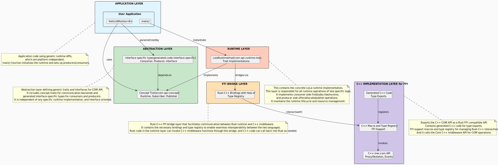

<!--
Copyright (c) 2026 Contributors to the Eclipse Foundation

See the NOTICE file(s) distributed with this work for additional
information regarding copyright ownership.

This program and the accompanying materials are made available under the
terms of the Apache License Version 2.0 which is available at
https://www.apache.org/licenses/LICENSE-2.0

SPDX-License-Identifier: Apache-2.0
-->
# Rust COM API

## Overview

The **COM API** is a Rust API for service-oriented inter-process communication (IPC) in the `mw::com` ecosystem.
It provides a clean, type-safe way for Rust applications to **offer** and **consume** services using a publish/subscribe event model.

Application code is written against a runtime-agnostic set of concepts (traits and types). At build or deployment time you select a concrete runtime implementation (for example a production runtime, or a mock runtime for tests) without rewriting business logic.

For internal architecture and implementation details, see [com_api_high_level_design_detail.md](../doc/com_api_high_level_design_detail.md)

### What This API Is For

- **Build service providers and consumers in Rust** using a common service-oriented model.
- **Keep business logic stable** while the underlying runtime implementation can differ (production vs. test).
- **Make IPC explicit**: offering, publishing, discovering, subscribing, and reading samples are all deliberate operations.

### Conceptual Architecture

At a high level, applications interact with the COM API concepts (Runtime, Producer/Consumer, Publisher/Subscriber). A concrete runtime implementation connects those concepts to the underlying communication technology using an FFI (Foreign Function Interface) layer that bridges the underlying C++ COM API to Rust.



If you’re interested in the detailed layering, module boundaries, and trait hierarchy, see [com_api_high_level_design_detail.md](../doc/com_api_high_level_design_detail.md).

## How It Works

### Service-Oriented Communication Model

The Rust COM API wraps the underlying C++ COM API and exposes a **publish/subscribe** model through type-safe Rust traits and abstractions.
A service is a logical entity with a well-known interface (a set of events and data types) and a location (an `InstanceSpecifier` path like `/vehicle/speed`).

Communication always flows in one direction for a given event: a **Producer** writes data, and one or more **Consumers** receive it.
Rust's traits provide compile-time guarantees and type safety, ensuring both sides only need to agree on the interface definition without knowing about each other at compile time.

### Core Concepts

| Concept | What it means in practice |
|---------|--------------------------|
| **Runtime** | The entry point for creating producers and discovering services. |
| **Producer** | The provider side: offers a service instance and publishes events. |
| **Consumer** | The user side: discovers a service instance and subscribes to its events. |
| **Service discovery** | Finds currently available service instances (availability can change over time). |
| **Publisher / Subscriber** | Typed endpoints for sending (`Publisher<T>`) and receiving (`Subscriber<T>`) event data. |
| **Subscription** | A `Subscription<T>` represents an event stream. |
| **Sample** | `Sample<T>` values are immutable snapshots you read from it. |
| **SampleContainer** | Container for reading samples from the event stream. |
| **InstanceSpecifier** | Path-like service address (e.g. `/vehicle/speed`). |

## Getting Started

```
Producer side                       Consumer side
─────────────────────               ─────────────────────
Create runtime                      Create runtime
Create producer for an instance     Find available instances
Offer service instance              Create consumer for an instance
Publish events                      Subscribe and receive samples
```

### Example Application

See [basic-consumer-producer.rs](../../../example/com-api-example/basic-consumer-producer.rs) for a complete working example demonstrating the producer/consumer workflow.

## Further Reading

- [com_api_high_level_design_detail.md](../doc/com_api_high_level_design_detail.md) — internal architecture, layer details, trait reference, and module structure
- [user_facing_api_examples.md](../doc/user_facing_api_examples.md) — user-facing API examples and usage patterns
- **com_api_concept** crate — detailed trait definitions and API documentation (Runtime, Producer, Consumer, etc.)
- **com_api** crate — public re-exports for user-side consumption