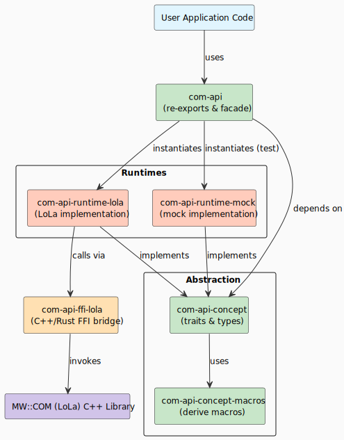

# COM API — High-Level Design

This document describes the internal architecture, trait hierarchy, module structure, and implementation details of the COM API framework. For an introduction and usage, see [README](README.md).

## Contents
- [Architecture overview](#architecture-overview)
- [Layers](#layers)
  - [Abstraction layer](#abstraction-layer)
  - [Runtime layer](#runtime-layer)
- [Data types and serialization](#data-types-and-serialization)
- [Contributing](#contributing)
- [Key Bazel targets](#key-bazel-targets)

## Architecture Overview
The COM API follows a layered architecture separating abstract contracts from concrete implementations:

> Source: [../doc/com_api_module_structure.puml](../doc/com_api_module_structure.puml)

## Layers

| Layer | Role |
|-------|------|
| **Application** | User code that implements business logic without needing to know implementation details. |
| **Abstraction** | Platform-independent trait definitions — the contract that binds application code to any runtime. |
| **Runtime** | Concrete implementations of the communication patterns, manages lifecycles of proxies and skeletons. |
| **C++ Middleware** | Handles the actual IPC and network operations — the foundation everything else rests on. |

### Abstraction layer
**Location**: [com-api-concept/](../com-api/com-api-concept/)

The Abstraction Layer defines platform-independent interfaces through a carefully designed set of traits. These traits establish contracts that any runtime implementation must fulfill. The layer also contains generated code around the generic traits using rust macro, making the API convenient for applications to use.

**Role and Scope**:
The Abstraction Layer serves as the boundary definition between application code and implementation code. It defines what operations are possible (through trait methods) without specifying how they're implemented. This layer is interface-oriented rather than implementation-oriented. It guarantees that any two different runtime implementations (whether LoLa-based, mock-based, or network-based) will provide the same method signatures and behavioral contracts. The generated code layer adds type safety by creating interface-specific consumer and producer types that wrap the generic trait implementations.

**Core traits**
| Trait | Purpose |
|-------|---------|
| `Runtime` | Root factory for service discovery, producers, and subscribers |
| `Interface` | Service interface contract with consumer/producer types |
| `Producer<R>` / `OfferedProducer<R>` | Server-side service implementation and offering |
| `Consumer<R>` | Client-side service consumer |
| `ServiceDiscovery<I, R>` | Service instance discovery and lookup |
| `Publisher<T, R>` | Event publication to subscribers |
| `Subscriber<T, R>` | Event subscription management |
| `Subscription<T, R>` | Active event subscription with polling/async support |
| `CommData` | Communication data type marker |

**Sample types**
| Type | Purpose |
|------|---------|
| `Sample<T>` | Immutable reference to received event data |
| `SampleMut<T>` | Mutable reference for data transmission |
| `SampleMaybeUninit<T>` | Uninitialized buffer for zero-copy data preparation |

**Instance identification**
| Type | Purpose |
|------|---------|
| `InstanceSpecifier` | Technology-independent service instance location (e.g., `/my/service/path`) |
| `FindServiceSpecifier` | Specifies whether to find a specific instance or any available instance |

### Runtime layer
The Runtime Layer provides concrete implementations of all traits defined in the Abstraction Layer. Different runtime implementations use different backends to achieve communication—whether through C++ middleware (LoLa), Mock based, or other technologies. Each runtime translates the generic trait interface into backend-specific operations while maintaining the same contract.

**Role and Scope**:
The Runtime Layer is the bridge between platform-independent abstraction (what operations are possible) and backend-specific implementation (how those operations are performed). A runtime implementation is responsible for translating generic trait operations into concrete calls appropriate to its backend, managing the lifecycle of backend-specific objects (proxies, skeletons, channels), handling subscription, and publisher. Each runtime can depend on implementation-specific bridges (e.g., FFI for C++ backends) while keeping all higher layers agnostic to the backend choice. Different runtimes may support different feature sets or have different performance characteristics, but all must implement the same trait contracts.

#### LoLa runtime (`com-api-runtime-lola`)
**Location**: [com-api-runtime-lola/](../com-api/com-api-runtime-lola/)

The LoLa Runtime is a concrete implementation of all traits from the Abstraction Layer, tailored specifically for the LoLa middleware communication. This runtime leverages shared memory and optimized communication patterns to achieve low-latency, zero-copy inter-process communication.

**Role and Scope**:
The LoLa Runtime is responsible for translating generic trait operations into concrete calls to the LoLa C++ middleware. It manages the lifecycle of LoLa proxies and skeletons, handles memory allocation within shared memory pools. It depends on the FFI Bridge Layer to safely interact with C++ objects and handles all the state machine logic needed to ensure correct transmission and reception of events.

**Key features**
- **Type-safe interface generation**: Automatic code generation from interface definitions ensures compile-time correctness through Rust's type system.
- **Zero-copy data handling**: Leverages shared memory backend through `Sample<T>` and `SampleMaybeUninit<T>` types for efficient data access.
- **Automated resource lifecycle management**: Manages lifecycle of C++ LoLa proxies and skeletons through automatic cleanup via Rust's `Drop` trait.

**Supported concept Traits by LoLa Runtime**
| Trait/Type | Supported |
|-----------|:---------:|
| `Runtime` | [x] |
| `Interface` | [x] |
| `Producer<R>` | [x] |
| `OfferedProducer<R>` | [x] |
| `Consumer<R>` | [x] |
| `ServiceDiscovery<I, R>` | [x] |
| `Publisher<T, R>` | [x] |
| `Subscriber<T, R>` | [x] |
| `Subscription<T, R>` | [x] |
| `CommData` | [x] |
| `Sample<T>` | [x] |
| `SampleMut<T>` | [x] |
| `SampleMaybeUninit<T>` | [x] |
| `InstanceSpecifier` | [x] |
| `FindServiceSpecifier::Specific` | [x] |
| `FindServiceSpecifier::Any` | [ ] |

**Note**: Consumer/producer types are auto-generated from Rust macros via interface definitions. User-facing APIs remain trait-based and implementation-agnostic.

**FFI bridge layer**

**Location**: [com-api-ffi-lola/](../com-api/com-api-ffi-lola/)

The FFI Bridge Layer translates between Rust and C++, defining the exact boundary where safe Rust code meets unsafe C++ middleware. This layer is kept thin and focused: it declares raw FFI functions from C++ and wraps them in safe Rust interfaces. The bridge handles the low-level details of memory layout, pointer conversions, and callback mechanisms.

**Role and Scope**:
- Raw FFI declarations (extern "C") mapping to C++ functions
- Safe wrapper functions that encapsulate the unsafe operations with SAFETY comments
- Callback adapters that translate C++ callback conventions to Rust closures
- Type converters that map between Rust and C++ data layouts
- Resource allocators and deallocators for both sides

#### Mock runtime (`com-api-runtime-mock`)
**Location**: [com-api-runtime-mock/](../com-api/com-api-runtime-mock/)

The Mock Runtime is an in-process, test-oriented implementation of all traits from the Abstraction Layer.

**Role and Scope**:
The Mock Runtime is designed to enable testing of application code without dependencies on concrete back-end . This runtime allows developers to test the logic and integration of their producers and consumers in isolation, catching errors early.

**Note**: Mock runtime support is not yet enabled in the current build.

## Data Types and Serialization

### Supported Data Types
The COM API supports position-independent data serialization:
| Category | Types |
|----------|-------|
| Primitives | `i32`, `u32`, `i64`, `u64`, `f32`, `f64`, `bool`, etc. |
| Static Collections | Fixed-size arrays, tuples |
| Dynamic Collections | `Vec<T>`, `String` with bounded capacity |
| Structures | User-defined structs with derived `CommData` and `Reloc` traits |
| Nested Types | Arbitrary nesting of above types |

### Relocatable Type Requirement
All event data transmitted via IPC must implement the `CommData` trait using derived macro `#[derive(CommData)]`.
**`CommData` adds four orthogonal bounds:**
- **`Reloc`**: address-independent and it implies `Unpin` (no self-referential pointers, can be safely relocated in memory)
- **`Send`**: thread-safe to send across thread boundaries
- **`Debug`**: can be printed for debugging
- **`'static`**: no borrowed references, guarantees the type owns all its data and can outlive any external context

## Contributing

### Code Organization
When extending the COM API:
1. **Generic Features**: Add to `com-api-concept` for implementation-agnostic traits
2. **LoLa Implementation**: Add to `com-api-runtime-lola` for concrete implementation of `com-api-concept` using the MW::COM (LoLa) backend
3. **Examples**: Update or add to `com-api-example` directory for demonstration code

### Naming Conventions
All naming in the COM-API adheres to [Rust Naming Guidelines](https://rust-lang.github.io/api-guidelines/naming.html):
- **Crates, modules, functions, variables**: `snake_case`
- **Types, traits, enum variants**: `CamelCase`
- **Constants**: `SCREAMING_SNAKE_CASE`

## Key Bazel Targets
| Target | Purpose |
|--------|---------|
| `//platform/aas/mw/com/impl/rust/com-api/com-api-concept` | Generic trait definitions and `CommData` / `Reloc` contracts |
| `//platform/aas/mw/com/impl/rust/com-api/com-api-runtime-lola` | LOLA runtime implementation (producers, consumers, publishers, subscribers) |
| `//platform/aas/mw/com/impl/rust/com-api/com-api-concept-macros` | Derive macros for `CommData` and `Reloc` |
| `//platform/aas/mw/com/impl/rust/com-api/com-api-runtime-mock` | Mock runtime for testing (not yet enabled) |
