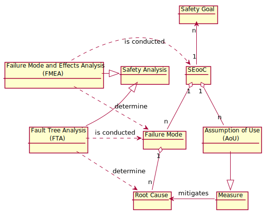
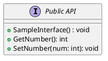

# Safety Analysis

This document shows the workflow and the interrelation on how to document an FMEA in TRLC / PlantUml / Lobster.

## Overview

The current proposal on how the Safety Analysis according ISO 26262 Pt9 shall be implemented is as described in the Model:



## Implementation

For the implementation of the Safety Analysis a Mix of TRLC and Plantuml is applied. The Verification itself is performed in lobster at the end.

For the Definition and Verification of the Safetyanalysis itself a Bazel rule exists:

```python
load("@//third_party/traceability/bazel:safety_analysis.bzl", "safety_analysis")

safety_analysis(
    name = "samplelibrary_safety_analysis",
    controlmeasures = [<Link to trlc_requirements target>],
    failuremodes = [<Link to trlc_requirements target>],
    fta = [<Link to filegroup containing puml files>],
    public_api = [<Link to filegroup containing puml files>],
)
```


### Failuremode

It starts with a Failuremode which was determined in an FMEA. This Failuremode is defined in a TRLC format:

```python
package SampleLibrary

import ScoreReq

SafetyAnalysis.FailureMode SampleFailureMode{
    guideword = SafetyAnalysis.GuideWord.LossOfFunction
    description = "SampleFailureMode takes over the world"
    failureeffect = "The world as we know it will end"
    version = 1
    safety = ScoreReq.Asil.B
    interface = "SampleLibraryAPI.SampleInterface"
}
```

### Root Causes
As described in the metamodel the root causes (aka BasicEvents) shall be identified by performing an FTA on each Failuremode.

The FTA shall be modeled using Plantuml. Therefore a Metamodel was defined using plantuml procedures. It includes following entities:

Events:
- $TopEvent($name, $alias)
- $IntermediateEvent($name, $alias, $connection)
- $BasicEvent($name, $alias, $connection)

Gates:
- $AndGate($alias, $connection)
- $OrGate($alias, $connection)

The Matching between TRLC and Plantuml shall be performed using the TRLC ID. This means that also the TopEvent of the FTA shall use the TRLC ID of the Failuremode . However in our case the Failuremode was defined in the package Communication. Therefore the Full ID of the TRLC node is:
Communication.SkeletonNotOffered

```plantuml
@startuml

!include fta_metamodel.puml

' Top level (skeleton)
$TopEvent("SampleFailureMode takes over the world", "SampleLibrary.SampleFailureMode")

' 2nd level gates and events
$OrGate("OG1", "SampleLibrary.SampleFailureMode")

$IntermediateEvent("SampleFailureMode is Angry", "IEF", "OG1")
$BasicEvent("Just bad luck", "SampleLibrary.JustBadLuck", "OG1")

' 3rd level cascades from AGF
$AndGate("AG2", "IEF")
$BasicEvent("No More Cookies", "SampleLibrary.NoMoreCookies", "AG2")
$BasicEvent("No More Coffee", "SampleLibrary.NoMoreCoffee", "AG2")
@enduml

```

## Control Measures
For each BasicEvent a Control Measure shall be derived. This will be performed again in TRLC. The Mapping between PlantUML and TRLC will be done again based on the ID. So for our case we will define a Control Measure for NoMoreCookies:

```python
SafetyAnalysis.AoU SampleAoU{
    safety = ScoreReq.Asil.B
    description = "We shall only order family size cookie jars"
    version = 1
    mitigates = "SampleLibrary.NoMoreCookies"
}

```

## Public API
Any method within a public API shall be analyzed in a FMEA. Accordingly each failure mode of an FMEA shall also be linked to an Interface which was defined in the software architectural design.


